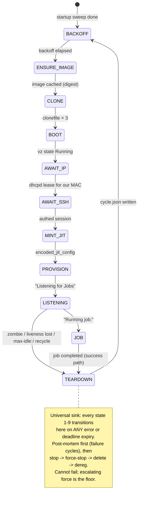

# ADR-0004: Crash-only state machine with per-state deadlines

**Status:** Accepted (2026-06-07; states finalized 2026-06-09)

## Context

sand's architecture allowed a single hung operation to freeze the daemon
forever, and its health check measured "process exists" rather than
"registered with GitHub". The replacement must guarantee that **no operation is
ever unbounded** and that every failure converges to a clean retry.

## Decision

One goroutine per runner slot drives an 11-state FSM. Every state is entered
with a `context.WithDeadline`; deadline expiry is just another event. The only
response to any failure is destroy-and-recycle (TEARDOWN → BACKOFF), with
capped exponential backoff (5 s base, ×2, cap 300 s; reset on job completion or
LISTENING held ≥ 10 min).

Key properties:

- **TEARDOWN is the success path too** — ephemeral runners exit after one job,
  so destroy-and-recycle is the normal loop, not error handling. Post-mortem
  collection (guest `_diag` tail) happens *before* destruction on failures,
  with its own 15 s best-effort budget. Teardown cannot fail; escalating force
  (`RequestStop` 10 s grace → `Stop()` → delete) is the floor.
- **Registration-aware health**: LISTENING reconciles against GitHub's runner
  list every 60 s. "Registration vanished" (zombie → recycle) is distinguished
  from "GitHub unreachable" (transient → hold and log) — sand conflated these.
- **Crash-only restart = cold start**: in-process VMs (ADR-0008) die with the
  daemon. Startup = validate → sweep (`vms/*`, offline GitHub registrations by
  name prefix) → fresh cycles. Disk holds artifacts, never authoritative state.
- Every teardown writes `cycle.json` — the machine-readable timeline that
  `runnyctl why` renders.

Per-state deadline defaults are calibrated from the 2026-06-09 spike (boot
266 ms → 30 s budget; IP 8.3 s → 60 s; SSH 11.2 s → 90 s) and live in config,
not code. The full normative state table lives in `docs/architecture/`.

## Rejected alternatives

- **Supervisor + retry wrappers around imperative flow** (sand's shape):
  recovery depends on every call site remembering its timeout; one miss hangs
  the daemon.
- **Persisted FSM state with resume-after-restart**: in-process VMs can't
  survive the daemon anyway; resuming half-built state machines adds modes
  without adding value. Cold start is simpler and always correct.
