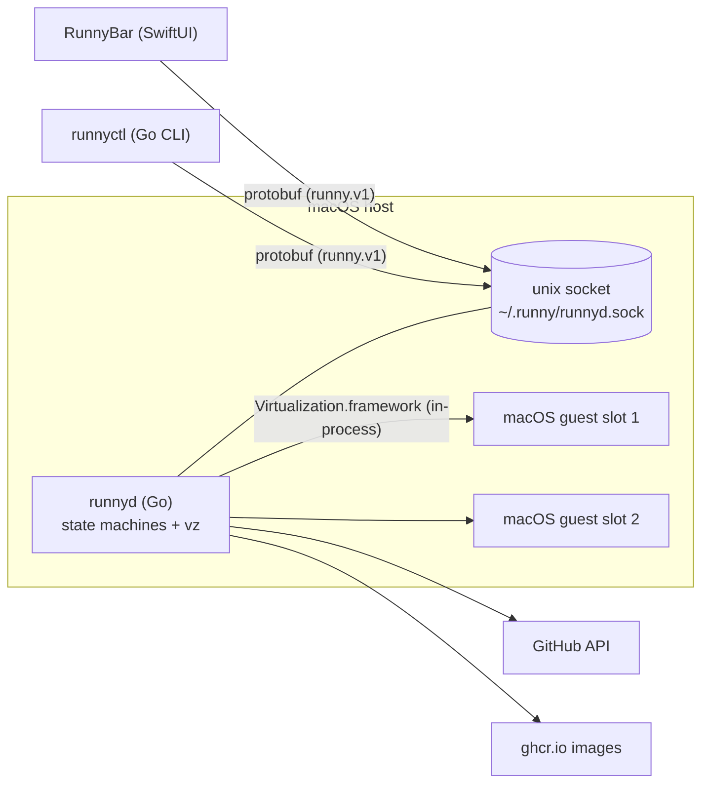

# ADR-0006: Monorepo layout and the in-graph protobuf contract

**Status:** Accepted (2026-06-09)

## Context

Three artifacts (Go daemon, Go CLI, Swift app) share exactly one thing: the
control protocol over the daemon's unix socket. The repo layout should make
language toolchains own their subtrees natively, with one deliberate shared
surface.

## Decision

- `cmd/runnyd`, `cmd/runnyctl` — Go binaries (gazelle-managed).
- `internal/` — daemon libraries; one package per concern (statemachine, sshx,
  vm, oci, github, home, socket).
- `proto/runny/v1/` — the contract: `proto_library` → `go_proto_library` +
  `swift_proto_library`, generated **in-graph**. No committed generated code.
- `apps/RunnyBar/` — SwiftUI app (ADR-0007).
- `docs/` — architecture, this ADR series, design plans, doc-system governance.

**`runnyctl` and RunnyBar are deliberately symmetric**: sibling clients of the
same `runny.v1` contract, no privileged path for either. Anything the CLI can
do, the app can do, by construction.

## Rejected alternatives

- **Shared Go model package imported by the CLI, ad-hoc JSON for the app**: a
  privileged client and a hand-maintained second serialization that drifts.
- **Committed buf-generated code**: works without Bazel, but requires a
  byte-equality gate to keep honest; in-graph generation makes drift
  structurally impossible.
