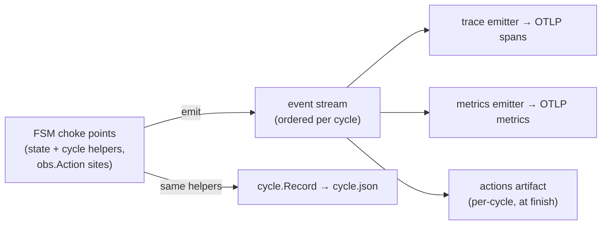

# ADR-0024: One observability event seam; OTLP telemetry as consumers

**Status:** Accepted (2026-07-01)

**Amended:** 2026-07-03 — trace and span IDs are SDK-random, not
deterministically derived from event identity. The determinism served a
replay-idempotency property (a retained cycle re-emits to the same trace)
for event-replay tooling that was never built, and the "reusable from
`runnyctl` without linking the OTEL SDK" derivation package it depended on
had no importer outside the trace emitter itself. Correlation is
attribute-based instead (`runny.cycle_id` on the root, `runny.pull.id` on a
shared pull's spans).

## Context

runny is built around a truthful record. Every cycle writes a cycle.json
timeline ([ADR-0004](0004-crash-only-state-machine.md)); the live status
snapshot is fed by the same FSM helpers that build that record; `runnyctl why`
renders it. Adding OTEL traces and metrics (so fleet health is visible in
standard tooling, not only through `runnyctl` and log scraping) raises a
design question that is not *where* to instrument — the FSM already has choke
points through which every state passes, and the record already carries
per-state timings and outcomes — but **what relationship telemetry has to the
record**: a second live output produced inside the FSM, or something derived
from the one output the FSM already produces.

Constraints that shape the answer:

- **Crash-only** ([ADR-0004](0004-crash-only-state-machine.md)): telemetry
  must never block or alter the cycle, and telemetry loss must be visible
  (logged), never silent.
- **No unbounded operations** ([ADR-0011](0011-bounded-contexts.md)): export
  and shutdown flush carry bounds; nothing in the telemetry path may wedge the
  slot goroutine.
- **Two surfaces must not disagree.** If the trace and cycle.json can tell
  different stories about the same cycle, both lose authority.
- **The daemon should not grow a listening socket** for observability; its
  attack surface today is one unix socket.
- **Guest-controlled strings** (job names) are bounded on the record path and
  must not become metric label cardinality.
- The shared image pull ([ADR-0021](0021-shared-image-pull.md)) is
  deliberately cycle-independent: one pull may serve many waiting slots, so
  pull-internal work cannot honestly parent under any single cycle's trace.

## Decision

**One event seam.** The FSM helpers that already append to the cycle record
emit a structured observability event at the same instant, from the same code
path — state entered/left, cycle started/finished, VM info learned, job
started/ended, audit entries. Events are emitted only from the slot's FSM
goroutine (total order per cycle for free), through a hook wired in `Deps`
next to the existing runner-line callback, with the same contract: it must not
block. Divergence between record and events is prevented by construction of
the code path — one helper, adjacent lines — rather than by paralleling two
recorders.

**Fine-grained actions ride the contexts the FSM already threads.** A small
`obs` package exposes `Action(ctx, name, fn)`: it emits start/end events
carrying whatever cycle/step identity the context holds. `bounded.Context`
delegates `Value`, so the scope propagates through the guest/network seams
untouched; a context without a scope degrades to a no-op. Domain packages
(images, guest, vm, sshx) never import the OTEL SDK, and a new FSM state or a
new action inherits record + trace + metrics without copying instrumentation.

**Telemetry is a set of event consumers.**

- The **trace emitter** renders the three-level hierarchy — a root span per
  cycle, a child span per FSM step, action spans under their step. Trace and
  span IDs are SDK-random; correlation is attribute-based (`runny.cycle_id`
  on the root, `runny.pull.id` on a shared pull's spans). Spans export as
  they complete; the root exports at cycle end, which is inherent to OTLP
  (there is no span-start wire message). The shared image pull emits under
  its own identity and waiting cycles record a wait action referencing it —
  attribution stays honest.
- The **metrics emitter** derives counters and duration histograms from the
  same events, and gauges from the existing status snapshots at collection
  time.
- **All export is OTLP push** to one configured endpoint, off by default, with
  exponential-histogram aggregation for durations. There is no Prometheus
  scrape listener: the daemon keeps zero listening TCP sockets, and
  Prometheus-family backends ingest OTLP natively. Export uses the SDK's
  drop-on-full batching (never block-on-queue-full); dropped telemetry and
  exporter errors are logged through the daemon log so loss is visible.
  Shutdown flush is deadline-bounded.

**Two detail tiers; nothing is trace-only.** FSM steps stay in cycle.json,
which continues to mirror the wire contract. Actions are finer-grained
recorded truth: collected per cycle and written as a cycle artifact at finish
(alongside cycle.json, same retention), rendered by `runnyctl why` on request
— but deliberately not part of the proto contract, so adding an action costs
no schema churn. The cycle's ending classification (operator recycle, daemon
shutdown, failure, success), computed today for backoff accounting and then
dropped, is persisted on the record: the cycle-outcome metric needs it as an
attribute, and `why` becomes more truthful for free.

## Rejected alternatives

- **Projection at cycle end** — render the finished cycle.Record into
  backdated spans in one hook, no live emission at all. Strongest possible
  no-divergence and crash-parity story, and the FSM diff is smallest. Rejected
  for visibility latency (a cycle holding LISTENING or JOB for hours produces
  no telemetry until it ends) and for its detail ceiling: every finer-grained
  span would first have to become record schema, i.e. proto churn, since
  cycle.json mirrors the wire contract. The adopted seam keeps the
  single-code-path property while emitting as work completes.

- **Fully event-sourced record** — the FSM only emits; cycle.Record is a fold
  over the event stream. One witness *by construction*, and the same fold
  would serve live building, crash synthesis, and re-rendering. Rejected for
  decomposition risk: it adds a serialized, multi-PR rewrite of the FSM's
  record handling — the most decision-dense code in the repo — with zero
  observable behavior change, and the write-ahead audit invariant ("no audit,
  no injection") forces synchronous persistence-acknowledged events anyway,
  so the purity is compromised from the start. The adopted emission seam is a
  strict prefix of this design; it remains reachable as an internal refactor
  if a fold is ever built for crash recovery.

- **Direct SDK spans inside the FSM** — `tracer.Start`/`End` at each site,
  the ecosystem-standard shape. Rejected: it scatters SDK calls through
  max-review code, every new state re-implements its instrumentation, the
  span timeline and the record become two witnesses that can drift, and spans
  buffered in the exporter die silently with the daemon.

- **BuildKit-style delegated exporter** — the daemon buffers spans and the
  CLI registers an exporter over the socket at connect time. Solves a problem
  runny does not have: BuildKit's CLI owns the user's environment and its
  daemon is collector-agnostic, whereas runnyd owns its config file and the
  collector is fixed fleet infrastructure. Direct export is one RPC surface
  smaller.

- **A Prometheus scrape endpoint** (client_golang or the OTEL Prometheus
  exporter). Rejected: it adds the daemon's first listening TCP socket, and
  the Prometheus exposition path is text-format-only — no exponential
  histograms. OTLP push delivers native histograms and reaches
  Prometheus-family backends through their OTLP receivers. client_golang
  would additionally mean a second instrumentation API beside the OTEL one
  the traces already require.

## Consequences

- The FSM diff is emission-only; instrumentation for a new state or action is
  inherited, not copied. The OTEL SDK is imported by exactly one package.
- Telemetry cannot disagree with the record (same code path) and cannot block
  it (async consumers, bounded flush, drop-and-log on backpressure).
- A daemon crash loses the in-flight cycle's events exactly as it loses that
  cycle's record — no better, no worse. A write-ahead event journal with
  crashed-cycle synthesis at cold start is a natural follow-on this event
  schema enables, deferred deliberately.
- The config schema gains an off-by-default observability block; config
  changes take effect through the existing reload path
  ([ADR-0014](0014-config-reload-drain-and-respawn.md)) — no runtime
  reconfiguration surface.
- The daemon gains outbound OTLP egress when configured, and no listener.
  Span attributes carry what the record carries (image refs, digests, runner
  names, capped job names) — no credentials, keys, or guest-controlled
  unbounded strings; metric labels are drawn from closed sets only.
- New direct dependencies: the OTEL API/SDK and OTLP exporters — already
  present transitively in the module graph today.
