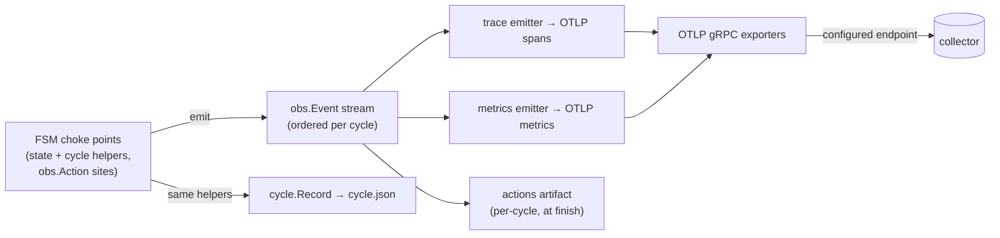

## Observability: one event seam, OTLP as a consumer

runny's telemetry is not a second instrumentation layer bolted onto the FSM —
it is a consumer of the same event stream the cycle record is built from. The
decision and its alternatives are [ADR-0024](../architecture-decisions/0024-observability-event-seam.md);
this is the current shape.

### The seam

`internal/obs` is the structured event stream: `Event`/`Kind`, a
context-carried scope (`WithCycle`, `WithStep`), and `Action(ctx, name, fn)`
for fine-grained work. It imports nothing beyond the standard library —
domain packages (`images`, `guest`, `sshx`) call `obs.Action` without ever
importing an OTEL type, and a context without a scope degrades `Action` to a
no-op. `bounded.Context` delegates `Value()` to its parent, so scope
propagates through every guest/network seam untouched.

### The runtime: `internal/telemetry`

`internal/telemetry` is runny's only OTEL importer. `telemetry.Setup` reads
`observability.otlp` from config and either installs providers or installs
nothing:

- **Absent endpoint (the default):** no SDK, no goroutines, no egress. The
  global OTEL providers stay the SDK's no-op implementations, and
  `obs.Action` call sites cost nothing beyond the scope lookup they already
  do.
- **Configured endpoint:** OTLP gRPC exporters for traces and metrics
  against the endpoint (`https` selects TLS, `http` selects an insecure
  local connection — the same rule `internal/home` already validates at
  config-load time). A batch span processor with the SDK's default
  drop-on-queue-full semantics — telemetry loss must be possible, telemetry
  backpressure into a slot must not be. A periodic metric reader at the
  configured interval. Every histogram instrument uses exponential (base-2)
  aggregation via an SDK view, so Prometheus-family backends ingest native
  histograms instead of fixed buckets.
- **Resource attributes:** `service.name=runnyd`, `service.version` (the
  build-stamped `version` in `cmd/runnyd/main.go`), `service.instance.id`
  (the persisted instance prefix, `home.Dir.InstancePrefix`), `host.name`.
- **Loss is never silent.** `otel.SetErrorHandler` routes every exporter and
  SDK error into the daemon's `slog` logger — the same sink cycle logs go
  to.
- **Shutdown is bounded.** `Setup` returns a `Shutdown` func that
  `cmd/runnyd` defers under a fixed wall-clock deadline. A dead or
  unreachable collector flushes what it can and returns; it cannot turn
  daemon exit into a hang, the same guarantee [ADR-0011](../architecture-decisions/0011-bounded-contexts.md)
  gives every other guest-facing operation.

### What this is not

`internal/telemetry` owns providers, resource attribution, and bounded
shutdown — not emission. The trace emitter and metrics emitter in the
diagram above, which fold `obs.Event` into actual spans and metrics, are
separate consumers that install onto the providers this runtime sets up;
they do not live in this package. Until they exist, a configured endpoint
gets a live OTLP connection carrying no traffic — the connection and its
resource attributes are real, the data isn't yet. An unconfigured daemon is
unaffected either way: no SDK, no goroutines, no egress.
