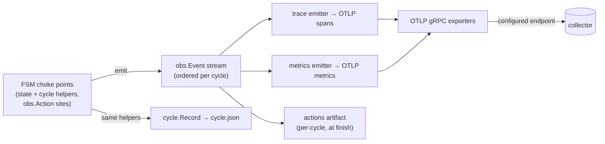

## Observability: one event seam, OTLP as a consumer

runny's telemetry is not a second instrumentation layer bolted onto the FSM —
it is a consumer of the same event stream the cycle record is built from. The
decision and its alternatives are [ADR-0024](../architecture-decisions/0024-observability-event-seam.md);
this is the current shape.

### The seam

`internal/obs` is the structured event stream: `Event`/`Kind`, a
context-carried scope (`WithCycle`, `WithStep`), and `Action(ctx, name, fn)`
for fine-grained work. It imports nothing beyond the standard library —
domain packages (`images`, `guest`, `sshx`) call `obs.Action` without ever
importing an OTEL type, and a context without a scope degrades `Action` to a
no-op. `bounded.Context` delegates `Value()` to its parent, so scope
propagates through every guest/network seam untouched.

### The runtime: `internal/telemetry`

`internal/telemetry` is runny's only OTEL importer. `telemetry.Setup` reads
`observability.otlp` from config and either installs providers or installs
nothing:

- **Absent endpoint (the default):** no SDK, no goroutines, no egress. The
  global OTEL providers stay the SDK's no-op implementations, and
  `obs.Action` call sites cost nothing beyond the scope lookup they already
  do.
- **Configured endpoint:** OTLP gRPC exporters for traces and metrics
  against the endpoint (`https` selects TLS, `http` selects an insecure
  local connection — the same rule `internal/home` already validates at
  config-load time). A batch span processor with the SDK's default
  drop-on-queue-full semantics — telemetry loss must be possible, telemetry
  backpressure into a slot must not be. A periodic metric reader at the
  configured interval. Every histogram instrument uses exponential (base-2)
  aggregation via an SDK view, so Prometheus-family backends ingest native
  histograms instead of fixed buckets.
- **Resource attributes:** `service.name=runnyd`, `service.version` (the
  build-stamped `version` in `cmd/runnyd/main.go`), `service.instance.id`
  (the persisted instance prefix, `home.Dir.InstancePrefix`), `host.name`.
- **Loss is never silent.** `otel.SetErrorHandler` routes every exporter and
  SDK error into the daemon's `slog` logger — the same sink cycle logs go
  to.
- **Shutdown is bounded.** `Setup` returns a `Shutdown` func that
  `cmd/runnyd` defers under a fixed wall-clock deadline. A dead or
  unreachable collector flushes what it can and returns; it cannot turn
  daemon exit into a hang, the same guarantee [ADR-0011](../architecture-decisions/0011-bounded-contexts.md)
  gives every other guest-facing operation.

### The trace emitter

`telemetry.NewTraceConsumer` folds one cycle's `obs.Event` stream into an
OTLP span tree: root `runny.cycle` → child `cycle.step <STATE>` per FSM step
→ grandchild `cycle.step.action <name>` per action within a step. Step and
action spans start and end on `StepEntered`/`StepLeft` and
`ActionStarted`/`ActionEnded`, stamped with the event's own timestamp so
span times match `cycle.json` exactly; a failed step or action carries
`Status=Error` with the recorded error, and the root mirrors `result` while
a benign ending (operator recycle, daemon shutdown) leaves the root
`Status=Unset` with the `ending` attribute carrying the story. Audit events
land as span events on the root, not as spans of their own — operator
access is visible in the trace with no key material attached.

A step's action children are conditional on that step's own implementation:
`cycle.step.action` spans exist only where the FSM code for that state wraps
a sub-step in `obs.Action` (`internal/obs`'s doc comment covers the wrapper
itself). A step whose implementation never calls it stays a leaf. Action
names are a closed set declared in `internal/obs` — read the const block
there for the current inventory — because each becomes a span name and a
metric label. An action can carry attributes (`obs.Attr`), passed through
verbatim to its span; a skipped sub-step (a teardown cleanup its cycle
didn't need) emits no action at all, so absence in the trace means the
sub-step didn't run.

Beyond the step tree, the trace carries the cycle's identity and audit
detail: the root's attributes include the pool, the assembled runner name,
and the VM's MAC/IP as they're learned; the owning step picks up the GitHub
runner ID at mint time and the job's operator-key fingerprints at job end;
audit span events mirror the record's full `InjectedKey` detail (comment,
reason, operator uid/user) — never key material.

Trace and span IDs are deterministic, derived by the OTEL-free
`internal/traceid` package from a cycle's own identity
(`instancePrefix`/`slot`/`cycleID`/`started` for the trace ID; the trace ID
plus the span's kind/step/action for each span ID — inputs a `cycle.json`
record fully determines, deliberately excluding the live stream's event
sequence numbers, which the record does not persist). A retained cycle
always maps to the same trace *and* the same spans, so re-emitting it is
idempotent, and the same derivation is available to `runnyctl` without
linking the OTEL SDK.

The consumer is wired into `cmd/runnyd` only when an endpoint is configured
— the same off-by-default rule as `Setup` itself, since an emitter costs
real bookkeeping on every `obs.Emit` call even against a no-op tracer.

### The metrics emitter

`telemetry.NewMetricsConsumer` is the second `obs.Event` consumer, sharing
the emitter fan-out with the trace consumer under the same off-by-default
wiring. It folds the stream into two counters (finished cycles, finished
jobs) and four seconds histograms (cycle, step, job, and action durations) —
the instrument inventory, each instrument's meaning, and its exact label set
live as doc comments on the instruments in `internal/telemetry/metrics.go`.
Two properties define the fold:

- **Durations are event-time arithmetic, never clock reads.** A step's
  duration is its `StepLeft` timestamp minus its `StepEntered` timestamp; a
  cycle's is `CycleFinished` minus the cycle's recorded start. The fold is a
  pure function of the stream, so a replayed stream produces the live
  stream's numbers, and an event whose start was never observed produces no
  duration point rather than a fabricated one. The cycle's `result` and
  `ending` labels are the persisted record classification, passed through
  `FinishEvent` — metrics can never disagree with `cycle.json` about how a
  cycle ended.
- **Every label is a closed set.** States, outcomes, endings, and action
  names are fixed vocabularies; pools and slots come from config. Job names
  and any other guest-controlled string never become labels — they exist
  only as span attributes on the trace side.

Alongside the event-derived instruments, `telemetry.RegisterGauges`
installs the status-polled side: observable gauges the SDK's periodic
reader collects on its own schedule, with zero FSM involvement — a poll of
each slot's status snapshot (the slot-state 0/1 matrix, state-entered time,
failure streak, wedged/paused flags) plus one free-space check on the runny
home filesystem. The state gauge reports 0/1 for **every** state per slot,
not just the current one, so a state change reports 0 on the old series
instead of letting it go stale. A disk-read failure surfaces as a callback
error through the OTEL error handler — never a silent skip, never a fake
zero. The gauges poll through a neutral snapshot seam, so `telemetry` never
imports the state machine.

Series from different daemons never collide: identity (which daemon, which
host) rides the resource attributes `Setup` installs — instrument labels
deliberately carry only pool/slot/vocabulary dimensions. Operator-facing
query recipes and the pipeline contract this implies live in
[deploy.md](../deploy.md).

### What this is not

`internal/telemetry` owns providers, resource attribution, bounded
shutdown, and the trace and metrics emitters. The remaining consumers in
the diagram above — the per-cycle actions artifact and anything else built
on the seam — are separate consumers that install onto the same emitter
fan-out; they do not exist yet. An unconfigured daemon is unaffected either
way: no SDK, no goroutines, no egress.
