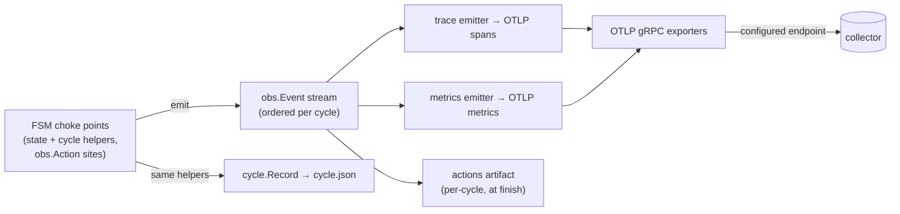

## Observability: one event seam, OTLP as a consumer

runny's telemetry is not a second instrumentation layer bolted onto the FSM —
it is a consumer of the same event stream the cycle record is built from. The
decision and its alternatives are [ADR-0024](../architecture-decisions/0024-observability-event-seam.md);
this is the current shape.

### The seam

`internal/obs` is the structured event stream: `Event`/`Kind`, a
context-carried scope (`WithCycle`, `WithStep`), and `Action(ctx, name, fn)`
for fine-grained work. It imports nothing beyond the standard library —
domain packages (`images`, `guest`, `sshx`) call `obs.Action` without ever
importing an OTEL type, and a context without a scope degrades `Action` to a
no-op. `bounded.Context` delegates `Value()` to its parent, so scope
propagates through every guest/network seam untouched.

### The runtime: `internal/telemetry`

`internal/telemetry` is runny's only OTEL importer. `telemetry.Setup` reads
`observability.otlp` from config and either installs providers or installs
nothing:

- **Absent endpoint (the default):** no SDK, no goroutines, no egress. The
  global OTEL providers stay the SDK's no-op implementations, and
  `obs.Action` call sites cost nothing beyond the scope lookup they already
  do.
- **Configured endpoint:** OTLP gRPC exporters for traces and metrics
  against the endpoint (`https` selects TLS, `http` selects an insecure
  local connection — the same rule `internal/home` already validates at
  config-load time). A batch span processor with the SDK's default
  drop-on-queue-full semantics — telemetry loss must be possible, telemetry
  backpressure into a slot must not be. A periodic metric reader at the
  configured interval. Every histogram instrument uses exponential (base-2)
  aggregation via an SDK view, so Prometheus-family backends ingest native
  histograms instead of fixed buckets.
- **Resource attributes:** `service.name=runnyd`, `service.version` (the
  build-stamped `version` in `cmd/runnyd/main.go`), `service.instance.id`
  (the persisted instance prefix, `home.Dir.InstancePrefix`), `host.name`.
- **Loss is never silent.** `otel.SetErrorHandler` routes every exporter and
  SDK error into the daemon's `slog` logger — the same sink cycle logs go
  to.
- **Shutdown is bounded.** `Setup` returns a `Shutdown` func that
  `cmd/runnyd` defers under a fixed wall-clock deadline. A dead or
  unreachable collector flushes what it can and returns; it cannot turn
  daemon exit into a hang, the same guarantee [ADR-0011](../architecture-decisions/0011-bounded-contexts.md)
  gives every other guest-facing operation.

### The trace emitter

`telemetry.NewTraceConsumer` folds one cycle's `obs.Event` stream into an
OTLP span tree: root `runny.cycle` → child `cycle.step <STATE>` per FSM step
→ grandchild `cycle.step.action <name>` per action within a step. Step and
action spans start and end on `StepEntered`/`StepLeft` and
`ActionStarted`/`ActionEnded`, stamped with the event's own timestamp so
span times match `cycle.json` exactly; a failed step or action carries
`Status=Error` with the recorded error, and the root mirrors `result` while
a benign ending (operator recycle, daemon shutdown) leaves the root
`Status=Unset` with the `ending` attribute carrying the story. Audit events
land as span events on the root, not as spans of their own — operator
access is visible in the trace with no key material attached.

A step's action children are conditional on that step's own implementation:
`cycle.step.action` spans exist only where the FSM code for that state wraps
a sub-step in `obs.Action` (`internal/obs`'s doc comment covers the wrapper
itself). A step whose implementation never calls it stays a leaf. Action
names are a closed set declared in `internal/obs` — read the const block
there for the current inventory — because each becomes a span name and a
metric label. An action can carry attributes (`obs.Attr`), passed through
verbatim to its span; a skipped sub-step (a teardown cleanup its cycle
didn't need) emits no action at all, so absence in the trace means the
sub-step didn't run.

Below the actions sits the HTTP egress layer: every outbound client
(GitHub API, registry, tarball CDN) routes through `obs.HTTPTransport`, an
`http.RoundTripper` that emits one `KindHTTP` event per round trip on
requests whose context carries an obs scope, which the trace consumer
renders as a completed client span — `http <class>` — under whatever was
innermost when the round trip finished (the open action, else the step,
else the root). Endpoint classes are a closed typed const set
(`obs.HTTPClass`) in `internal/obs`; in the GitHub and registry clients the
class is a parameter of the request choke point, so a new endpoint cannot
compile without stating one, and no code classifies by parsing a URL — so
paths and queries (which can carry org/repo names and credentials) never
reach telemetry by construction. The span records method, status code, and
the request host (service-controlled at worst — a redirect hop is its own
round trip and reports the host it actually hit); span status follows the
HTTP client semconv rule: any 4xx/5xx or transport failure is an error, so
a 503 retry storm can't render as healthy spans under a red action — which
means the registry's routine 401 token challenge shows as an errored hop
whose enclosing `resolve` action staying green is what says the dance
succeeded. The span covers the *whole* exchange, not just the wait for
headers: the transport wraps the response body and the event fires at body
completion (EOF or close), so the span carries the transfer's true
duration and byte count (`runny.http.bytes`), a `headers` span event marks
where waiting ended and transfer began, and a body that dies mid-stream —
the stall-kill shape — reports the status the headers claimed plus the
read error as span error status. One caveat is load-bearing: the shared
pull actor's blob traffic carries a *pull* scope (`obs.WithPull`), not a
cycle scope — a pull belongs to no single cycle — so this trace consumer,
which attributes every span through `runny.cycle_id`, renders none of it;
folding pull-scoped events into their own trace is a separate consumer.

Beyond the step tree, the trace carries the cycle's identity and audit
detail: the root's attributes include the pool, the assembled runner name,
the configured image ref, and — as they're learned mid-cycle — the VM's
MAC/IP, the resolved image digest, and the runner-tarball version (the
digest and runner version also land on the ENSURE_IMAGE step span, next to
the actions that produced them, so a trace is queryable by image without
joining cycle.json); the owning step picks up the GitHub runner ID at mint
time and the job's operator-key fingerprints at job end; audit span events
mirror the record's full `InjectedKey` detail (comment, reason, operator
uid/user) — never key material. Identity learned mid-cycle always travels
as a typed event emitted where the record learns the same fact — typed
payloads and explicit per-fact consumer routing, and a replayed record
determines the event by construction; attributes on actions are reserved
for action-local facts like the pull id, values that describe one
execution of one action and die with its span.

Trace and span IDs are SDK-random, assigned the same way any OTEL-instrumented
process gets them. Correlation is attribute-based instead of ID-based:
`runny.cycle_id` on the root identifies the cycle a trace belongs to, and
`runny.pull.id` correlates the cycles that waited on one shared image pull —
querying by attribute finds the related spans without needing a derived,
reproducible ID.

The consumer is wired into `cmd/runnyd` only when an endpoint is configured
— the same off-by-default rule as `Setup` itself, since an emitter costs
real bookkeeping on every `obs.Emit` call even against a no-op tracer.

### The metrics emitter

`telemetry.NewMetricsConsumer` is the second `obs.Event` consumer, sharing
the emitter fan-out with the trace consumer under the same off-by-default
wiring. It folds the stream into counters and seconds-denominated duration
histograms; the instrument inventory, each instrument's meaning, and its
exact label set live as doc comments on the instruments in
`internal/telemetry/metrics.go`. Two properties define the fold:

- **Durations ride the event, the consumer holds no state.** `StepEvent` and
  `JobEvent` each carry their own `Duration` — stamped by the FSM at
  `StepLeft`/`JobEnded` from the `cycle.StateRecord`/`JobInfo` it already
  holds — so the metrics consumer is a pure event→instrument fold with no
  per-cycle tracking to accrete or clean up. A cycle's duration is
  `CycleFinished` minus the cycle's recorded start. A zero `Duration` (a
  stray or legacy event) records the count where applicable but skips the
  histogram, never a fabricated point. The cycle's `result` and `ending`
  labels are the persisted record classification, passed through
  `FinishEvent` — metrics can never disagree with `cycle.json` about how a
  cycle ended.
- **Every label is a closed set.** States, outcomes, endings, and action
  names are fixed vocabularies; pools and slots come from config. Job names
  and any other guest-controlled string never become labels — they exist
  only as span attributes on the trace side.

A third family records **outside the fold**: the image ensurer's pull and
tarball-download instruments (`telemetry.NewEnsurerMetrics`, injected into
`internal/images` behind a plain-func seam the way progress reporting is).
A shared image pull serves many subscribing slots and belongs to no single
cycle, so its duration and bytes are per-underlying-work truths recorded
once at the pull's terminal outcome — never once per subscriber, and never
fabricated for a pull cancelled before it finished. Each subscribing
cycle's *experience* of that pull is its `wait-for-pull` action, which the
event fold exports like any other action (a per-cycle duration, one point
per waiting slot) — the two views measure different things and must not be
summed. Instrument meanings and label sets live as doc comments on the
instruments, alongside the event-derived ones.

Alongside the event-derived instruments, `telemetry.RegisterGauges`
installs the status-polled side: observable gauges the SDK's periodic
reader collects on its own schedule, with zero FSM involvement — a poll of
each slot's status snapshot plus one free-space check on the runny home
filesystem. The slot-state gauge reports 0/1 for **every** state per slot,
not just the current one, so a state change reports 0 on the old series
instead of letting it go stale. A disk-read failure is reported to the OTEL
error handler and the disk point is omitted for that collection — never a
fake zero, and never a callback error, because the SDK skips exporting the
*entire* collection when any observable callback errors, which would black
out every runny metric during exactly the disk incident the slot gauges
need to narrate. The gauges poll through a neutral snapshot seam, so
`telemetry` never imports the state machine.

Series from different daemons never collide: identity (which daemon, which
host) rides the resource attributes `Setup` installs — instrument labels
deliberately carry only pool/slot/vocabulary dimensions. Operator-facing
query recipes and the pipeline contract this implies live in
[deploy.md](../deploy.md).

### What this is not

`internal/telemetry` owns providers, resource attribution, bounded
shutdown, and the trace and metrics emitters. The remaining consumers in
the diagram above — the per-cycle actions artifact and anything else built
on the seam — are separate consumers that install onto the same emitter
fan-out; they do not exist yet. An unconfigured daemon is unaffected either
way: no SDK, no goroutines, no egress.
