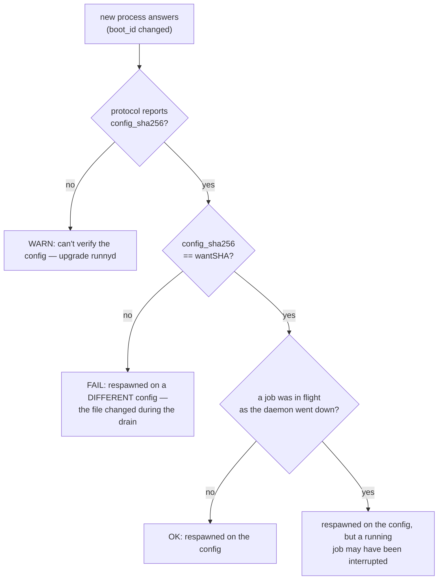

# Reload convergence

How a client confirms a config reload converged. The drain-and-respawn mechanism
itself lives in [runnyd.md](runnyd.md#draining-the-two-restart-causes); this doc
is the client-facing other half — proving the respawn that came back is the one
you asked for. The decisions behind it (why a per-process identity, why the
breadcrumb was cut, why three clocks) are
[ADR-0017](../architecture-decisions/0017-confirming-reload-convergence.md).

## Why "the socket came back" is not enough

A reload exits the daemon and launchd `KeepAlive` cold-starts it. But launchd
restarts on *any* exit, so a socket that reappears is ambiguous: the respawn on
the new config, a crash restarted on the *old* config, or a respawn on a file
re-edited mid-drain. Confirming a reload means identifying *the* respawn, on
*the* config the preflight vetted — positively, from published signals, never
from reachability.

## The respawn fingerprint

Two published signals, captured in a single round-trip, combine into a positive
identification:

| Signal | Proves |
| --- | --- |
| `boot_id` differs from the `accepting_boot_id` the `Reload` response returned | a genuinely new process — a random per-cold-start identity, distinct from the respawn-stable instance-id, so it can discriminate where a timestamp cannot |
| `config_sha256` == the hash the `Reload` response returned | the new process loaded the exact file the preflight vetted |

Because the baseline is the **accepting process's own** `boot_id`, carried back
in the reload response, there is no pre-RPC read whose process could differ — the
sub-RPC identity race is closed by construction. Each signal is gated on the
daemon's `WireProtocolVersion`; a daemon too old to report a `boot_id` yields an
honest "respawned, but can't verify" warning (degrading to the start-time
discriminator) instead of a false confirm. The floor version lives in
`internal/socket` and is not restated here.

## Two-phase bounding

The wait splits into two phases with categorically different failure modes, so
they are bounded differently. A running job can hold the drain for hours and the
daemon refuses a drain budget on purpose, so the drain phase must *not* be
wall-clock-capped — only the respawn phase is. Each clock is a backstop sized to
its phase's healthy magnitude, never a sum of the daemon's internal budgets (the
[bounds principle](bounds.md)).

```mermaid
sequenceDiagram
    participant C as client (runnyctl -wait / app)
    participant D as runnyd (draining)
    participant L as launchd
    participant D2 as runnyd (respawn)

    C->>D: open WatchStatus (establish backstop) + capture daemon_started
    C->>D: Reload(reason)
    D-->>C: accepted + config_sha256 (wantSHA) + accepting_boot_id (baseline)

    rect rgb(245, 245, 220)
    note over C,D: FOLLOW — progress-bounded on drain_seq, NO wall-clock cap
    loop until a different boot_id, or the stream ends
        D-->>C: WatchStatus snapshot (draining, drain_seq, slots)
    end
    end

    D->>L: exit non-zero
    note over C: stream drops; a probe confirms the daemon is gone — the respawn clock STARTS here

    rect rgb(220, 235, 245)
    note over C,D2: AWAIT-RESPAWN — hard wall-clock cap from the disappearance
    L->>D2: cold start on the new config (fresh boot_id)
    loop poll until boot_id != baseline
        C->>D2: GetStatus
    end
    end

    D2-->>C: new boot_id + config_sha256
    note over C: verdict (see below)
```

In FOLLOW the stall catches a daemon that stopped making drain progress —
`drain_seq` frozen across heartbeats — distinct from a slow-but-healthy drain
that keeps bumping it. The stall is **carried across stream reopens** (a flapping
stream cannot reset it forever) and **suppressed** while a slot is legitimately
long-running (a running job, a progress-bounded pull) or the exit gate is held —
those are bounded daemon-side or operator-actionable, not hangs. It is **disabled
outright against a pre-2 daemon**, which publishes no `drain_seq`: with no
progress signal the bound could only degrade into a wall-clock cap on the drain
(the cap this design refuses), so a pre-2 drain falls back to stream-liveness and
the respawn cap, and the accept-time warning says so. Anchoring the
respawn cap on the daemon's *disappearance*, confirmed by a probe rather than a
single dropped stream, is what lets a long healthy drain precede a short bounded
respawn wait without the two interfering. Ctrl-C stops following without
cancelling the drain.

## The verdict

Once a new process answers, one pure classification over the fingerprint decides
the outcome. Only **config drift** is actionable (a non-zero CLI exit / a failure
alert in the app); everything else is a confirmed success or a degraded-but-ok
warning.



Whether a job was in flight is **observed**, not handed across the process
boundary: a follower watched the drain, so the last old-process snapshot it saw
answers it. A client that connected too late to observe the drain reports the
convergence and notes it did not see the drain. `respawnVerdict` (in `cmd/runnyctl`
and mirrored in the app's `DaemonStore`) is the authority on the exact branches
and wording; the diagram tracks it but the code is canonical.

## Clients

- **`runnyctl reload -wait`** drives the full sequence: it opens the stream,
  validates, follows the live drain, then confirms the respawn and prints the
  verdict (`-respawn-timeout` caps AWAIT-RESPAWN; `-timeout` is the optional
  end-to-end cap, off by default). Without `-wait` the command returns as soon as
  the drain starts.
- **The Runny app** reuses its existing reactive supervisor for the drain (the
  draining banner and reconnect-across-respawn already come from the live
  `WatchStatus` stream, [ADR-0016](../architecture-decisions/0016-runny-app.md))
  and adds the verdict — surfaced when `boot_id` changes — plus two backstops: a
  silence deadline for a daemon that died and never returned, and a `drain_seq`
  progress stall for one that still heartbeats but stopped draining. The Reload
  control sits in the popover footer and on the main-window daemon card; its
  confirmation dialog is hosted on the main window. See [runny-app.md](runny-app.md).
