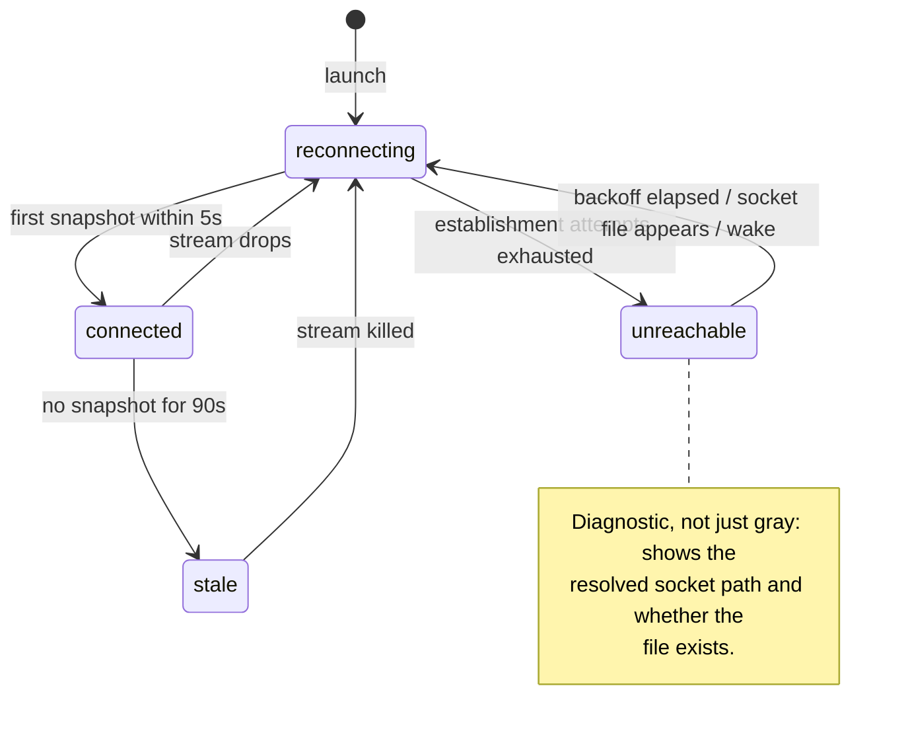

# Runny app architecture

The current shape of the macOS app. Decisions and their alternatives live in
`../architecture-decisions/` (the app's founding decisions are
[ADR-0016](../architecture-decisions/0016-runny-app.md)); this doc tracks the
code at `apps/Runny`.

## The two surfaces

Runny is a sibling client of `runny.v1` over the daemon's unix socket — no
privileged path, symmetric with `runnyctl` by construction (ADR-0006). It
presents two surfaces over one shared connection:

- **Menu bar** — a `MenuBarExtra` (`.window` style) popover: visual
  `runnyctl status`. Connection-state dot, daemon version/uptime (or the
  unreachable diagnostic), one row per slot mirroring runnyctl's status
  semantics.
- **Main window** — `NavigationSplitView`: a sidebar of runners plus a
  daemon card, and a per-slot detail pane with Info, a completed-cycles
  Timeline (from `Why`), and Logs tabs, plus a Doctor pane.

The app is `LSUIElement` and lives in the menu bar; it flips activation
policy to `.regular` while the main window is open and back to `.accessory`
when it closes (ADR-0007, as amended). The proto file is the authority on
the control surface the app consumes; the `SlotState` display mapping
(`apps/Runny/Sources/Client`) is the authority on cycle-order rendering —
neither is enumerated here.

## Connection supervision

`DaemonStore` owns one supervised `WatchStatus` stream and a four-state
connection FSM — the daemon-side crash-only philosophy applied to the
client: streams are torn down and re-established, never nursed. This is the
living diagram and tracks the code.

- **connected** — snapshots flowing.
- **reconnecting** — the stream dropped. Every daemon restart cuts streams;
  this is routine, and the UI stays amber through the first backoff round
  rather than flapping to gray on every restart.
- **unreachable** — establishment keeps failing. Rendered as a diagnostic:
  the resolved socket path and whether the file exists ("no socket at
  `~/.runny/runnyd.sock` — is runnyd running, or using a different home?").
- **stale** — the stream is open but silent past the staleness bound. The
  app kills the stream, surfaces "last update Xs ago", and re-enters
  reconnect. An open-but-silent stream is the wedged-but-alive daemon made
  visible — exactly the failure a connection-level check cannot see.

### The bounds

No step of supervision is unbounded:

- **Establishment is end-to-end bounded: dial *plus first snapshot* within
  5s**, or tear down and retry. A UDS `connect()` succeeds into the kernel
  backlog even when nothing is accepting, so a successful connect proves
  nothing; only a received snapshot does.
- **Staleness: 90s without a snapshot.** The server guarantees a 30s
  keepalive tick on `WatchStatus`, so 90s is three missed ticks — slow is
  distinguished from dead by construction, not by guessing.
- **Reconnect backoff: 1s doubling to a 30s cap, with jitter.** Backoff
  resets early on `NSWorkspace.didWakeNotification` and on socket-file
  appearance (a dispatch-source watch on the socket directory), so the app
  is not blind for a backoff interval after sleep or a daemon start.
- **Unary deadlines** on every RPC: 5s for commands, 10s for `Why`/`Doctor`.

## Command confirmation

An RPC success for Pause/Resume/Recycle means **requested**, not done. The
app shows a pending indicator and confirms the command from the state change
in subsequent `WatchStatus` snapshots; if confirmation doesn't arrive within
10s, it says so. Errors switch on the gRPC status code, with the server's
message text rendered verbatim as the fallback.

## Timeline: current and completed cycles

The Timeline tab shows the current in-flight cycle and completed past cycles
from the `Why` RPC.

**Current cycle** — the daemon streams per-state history as part of each
`WatchStatus` snapshot via `SlotStatus.active_cycle_states`. Each entry is a
`StateRecord` with `entered`, `left`, and `outcome`, appended at state
transition: when state N starts, the snapshot includes all states 0..N-1 as
completed records. The current state is `state` + `state_entered` — rendered
with a live ticking clock. The app builds a `[SlotState → TimeInterval]`
lookup from the completed records and passes each duration to the
corresponding pipeline row.

Older daemons that predate this field send `active_cycle_states` as empty;
the app degrades gracefully (pipeline rows show position/glyph only, no
durations for completed states).

**Completed cycles** — fetched from `Why` on demand, rendered from the
`cycle.json` artifact. This path is unchanged.

## Log streams are honestly lossy

Each visible log view owns one `StreamLogs` (bounded replay, then follow),
torn down when the view disappears. Appends land in a bounded in-memory
ring. On reconnect the view inserts a visible discontinuity row ("—
reconnected; lines may be missing or duplicated —"): the stream is
best-effort by contract, log lines carry no sequence key, and pretending to
a gapless tail would be a silent lie. No deduplication is attempted.

## Socket path resolution

A UserDefaults override (set in Settings) wins; otherwise the socket lives
under `~/.runny`. The daemon's `$RUNNY_HOME` convention does not apply:
a Finder-launched app inherits launchd's environment, not the shell's, so an
exported variable never reaches it. The app reads nothing else from the
runny home — files under `~/.runny` belong to the daemon (ADR-0006
symmetry: the app knows only the contract).

## Build shape

`swift_library` → `macos_application` (rules_apple) → the sign / notarize /
dmg chain in `apps/Runny/BUILD` — no .xcodeproj, ever (ADR-0007). All Swift
targets are darwin-only (`target_compatible_with`), so non-macOS hosts prune
them from `//...` before toolchain resolution. Building the app requires
full Xcode as SDK vendor; it is never opened. Distribution is a notarized,
stapled .dmg (ADR-0016).
