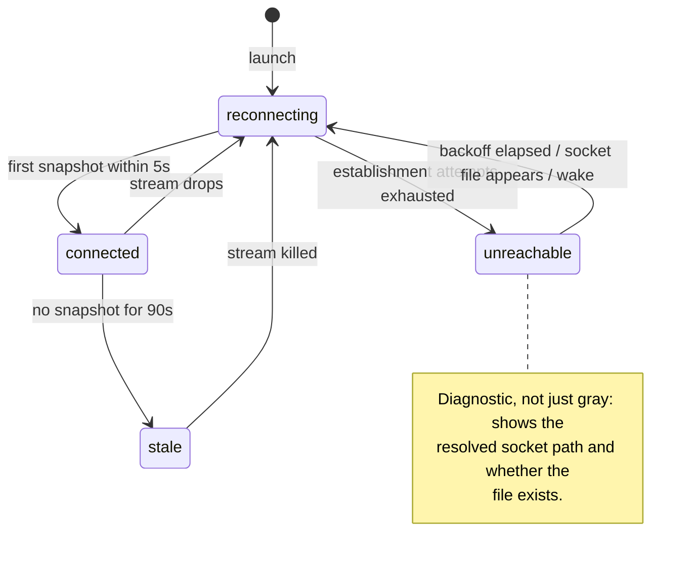

# Runny app architecture

The current shape of the macOS app. Decisions and their alternatives live in
`../architecture-decisions/` (the app's founding decisions are
[ADR-0016](../architecture-decisions/0016-runny-app.md)); this doc tracks the
code at `apps/Runny`.

## The two surfaces

Runny is a sibling client of `runny.v1` over the daemon's unix socket — no
privileged path, symmetric with `runnyctl` by construction (ADR-0006). It
presents two surfaces over one shared connection:

- **Menu bar** — a `MenuBarExtra` (`.window` style) popover: visual
  `runnyctl status`. Connection-state dot, daemon version/uptime (or the
  unreachable diagnostic), one row per slot mirroring runnyctl's status
  semantics.
- **Main window** — `NavigationSplitView`: a sidebar of runners plus a
  daemon card, and a per-slot detail pane with Info, a completed-cycles
  Timeline (from `Why`), and Logs tabs, plus a Doctor pane.

The app is `LSUIElement` and lives in the menu bar; it flips activation
policy to `.regular` while the main window is open and back to `.accessory`
when it closes (ADR-0007, as amended). The proto file is the authority on
the control surface the app consumes; the `SlotState` display mapping
(`apps/Runny/Sources/Client`) is the authority on cycle-order rendering —
neither is enumerated here.

## Connection supervision

`DaemonStore` owns one supervised `WatchStatus` stream and a four-state
connection FSM — the daemon-side crash-only philosophy applied to the
client: streams are torn down and re-established, never nursed. This is the
living diagram and tracks the code.

- **connected** — snapshots flowing.
- **reconnecting** — the stream dropped. Every daemon restart cuts streams;
  this is routine, and the UI stays amber through the first backoff round
  rather than flapping to gray on every restart.
- **unreachable** — establishment keeps failing. Rendered as a diagnostic:
  the resolved socket path and whether the file exists ("no socket at
  `~/.runny/runnyd.sock` — is runnyd running, or using a different home?").
- **stale** — the stream is open but silent past the staleness bound. The
  app kills the stream, surfaces "last update Xs ago", and re-enters
  reconnect. An open-but-silent stream is the wedged-but-alive daemon made
  visible — exactly the failure a connection-level check cannot see.

### The bounds

No step of supervision is unbounded:

- **Establishment is end-to-end bounded: dial *plus first snapshot* within
  5s**, or tear down and retry. A UDS `connect()` succeeds into the kernel
  backlog even when nothing is accepting, so a successful connect proves
  nothing; only a received snapshot does.
- **Staleness: 90s without a snapshot.** The server guarantees a 30s
  keepalive tick on `WatchStatus`, so 90s is three missed ticks — slow is
  distinguished from dead by construction, not by guessing.
- **Reconnect backoff: 1s doubling to a 30s cap, with jitter.** Backoff
  resets early on `NSWorkspace.didWakeNotification` and on socket-file
  appearance (a dispatch-source watch on the socket directory), so the app
  is not blind for a backoff interval after sleep or a daemon start.
- **Unary deadlines** on every RPC: 5s for commands, 10s for `Why`/`Doctor`.

## Command confirmation

An RPC success for Pause/Resume/Recycle means **requested**, not done. The
app shows a pending indicator and confirms the command from subsequent
`WatchStatus` snapshots; if confirmation doesn't arrive within 10s, it says
so. Errors switch on the gRPC status code, with the server's message text
rendered verbatim as the fallback. A definitive rejection — `NotFound`,
`FailedPrecondition` (e.g. a resume refused because the daemon is draining,
whose message is shown verbatim), or `InvalidArgument` — proves the command
never applied, so it clears the pending and surfaces the error at once.
Ambiguous errors keep the pending: the daemon may have applied the command
after the error, so the 10s watchdog is the honest adjudicator rather than a
premature failure banner. `Unavailable` is treated as ambiguous, not
definitive: grpc-swift uses it for both the daemon's full-command-buffer
rejection (which did not apply) and a dead transport (which may have applied
before the connection died), indistinguishable at the client, so it fails safe
toward the watchdog. A deadline or transport drop is ambiguous for the same
reason.

The error banner is a single scalar shared across slots, so it carries the id
of the command that raised it. An ambiguous error sets the banner while keeping
the pending; if a later snapshot then confirms that exact command, the
confirmation retracts its own banner — matched by id, so it never wipes a
genuine failure banner belonging to a different slot's command.

Confirmation keys on the **specific command**, not a matching state. A pause
or resume carries a random command id on the request; the daemon records it in
the slot's `recent_applied_command_ids` **only when the command actually
applies**, and the app confirms on its id being **present in that history** —
membership alone, with no paused-direction check. Because the id is recorded
only on apply, membership already proves the command ran; a direction belt would
be worse than redundant, since a fast superseding command (a resume right after
our pause applied) flips `paused` before the next snapshot and would make a
`&& paused` test reject a pause that did run — timing it out into a false
not-confirmed banner. Membership also stops a periodic snapshot that merely
carries `paused=true` from confirming — and so disarming the watchdog for — a
pause the daemon hasn't run yet. A history rather than a single last-applied id
so concurrent clients (the app plus a `runnyctl` invocation, or a fast second
command) don't clobber each other's acknowledgement: each finds its own id
regardless of the others. Recycle has no recorded id and confirms on a cycle
change, the observable it has always used.

The history is bounded and best-effort, not a durable per-client receipt: an id
need only survive from the snapshot that carries it until the app's next poll,
so the cap is generous but finite, and a daemon restart drops it entirely (the
random id can't collide, so the command just waits out its 10s watchdog). The
app keys confirmation off the live `WatchStatus` stream, never off a stored
receipt, so this honesty hole is closed by construction — a missed ack always
fails safe toward the watchdog, never toward a false confirm.

Pause/resume confirmation is gated on the daemon's `protocol_version`. A
daemon that predates the ack contract advertises 0 and never records an id, so
the app reports the command **sent but unconfirmable** (with an upgrade hint)
rather than risk a false confirm or a guaranteed false timeout. While a
command is pending for a slot, a second one — of any kind, including a recycle
over a pending pause/resume or vice versa — is rejected: pending is keyed by
slot, so a second would install a fresh entry under the same key and lose the
first's watchdog. The guard sweeps confirmed and expired pendings to ground
truth before reading them, so a retry in the brief window after a command's 10s
bound elapses but before its entry is reaped can't overwrite a still-live
pending and lose its watchdog.

## Version skew

The app and the daemon it watches can be at different versions — a host where a
Homebrew-managed `runnyd` runs at one release while the app is at another, or the
upgrade window where a new app is already talking to a not-yet-restarted old
daemon. The app renders that divergence as a first-class **warning, never a
refusal**: no control is disabled, no connection is dropped, no command is
blocked on skew.

The detector compares two independent axes, neither implied by the other. The
**version** axis asks "is this the same release line?" — but the two sides
express their version differently: the daemon publishes its full build label
(`0.6.0-beta.<sha>`) while the app's `CFBundleShortVersionString` is already
regex-stripped by the build to its `x.y.z` core. A raw string compare would
false-alarm on every beta and CI build — the same commit, reported two ways — so
the app normalizes the daemon string to its `x.y.z` core before comparing. The
skew warning **names the normalized cores**, not the daemon's full sha-bearing
string — the full daemon version is shown in the `runnyd <version>` line above
either surface — so a same-core daemon rebuild that only rotates its build sha
doesn't re-pop a dismissed warning. The **protocol**
axis asks "can the app rely on the features it was built for?" — it compares the
daemon's monotone `protocol_version` against the version the app's wire stubs
expect. After normalization this is the *only* detector for a same-`x.y.z`
new-app/old-daemon pair, so it is load-bearing, not a backstop. It fires only
when the daemon is *behind* (`<`); a newer daemon serving an older-expecting app
is the safe monotone direction and stays quiet.

The verdict carries a machine-readable `kind` (`versionMismatch` or
`protocolBehind`) rather than only prose, so a consumer acts on the axis, never
by re-parsing the text — the same discipline the wire contract keeps for
`draining`/`exit_held`. It stays quiet for the cases that would otherwise nag
falsely: a daemon whose version isn't known yet (fresh connect, or one predating
the field), and an unstamped dev build (`0.0.0`).

Both surfaces read a single connection-gated `visibleSkew`, so neither view
re-implements the connection check: on a drop the supervisor flips the connection
state without re-running `apply()`, and a stored verdict that outlived the live
stream would assert skew about a daemon that may have recycled. The popover shows
it as a dismissible banner (reading `shownSkew`, `visibleSkew` minus what the
operator dismissed); the main-window daemon card shows it as an always-on row,
since the card is the authoritative status surface and keeps telling the truth
after the popover's nag is silenced. Dismissal is keyed on the whole verdict
value, so a worsening or different-axis skew on the same version string
re-surfaces as new news rather than staying hidden.

## Reload

A Reload control in the popover footer and on the main-window daemon card
validates the on-disk config and drains the fleet toward a respawn; because that
restarts the whole daemon, it is gated behind a confirmation dialog (hosted on
the main window — the popover panel has no reliable presenter, so the popover's
button routes through the window). The drain itself shows through the existing
live stream; the app adds only the **verdict**, baselined on the accepting
process's `boot_id` from the reload response and resolved when a snapshot reports
a different one. Two backstops cover the two failure shapes: a silence deadline
for a daemon that died and never returned, and a `drain_seq` progress stall for
one that still heartbeats but stopped draining — suppressed while a slot is
legitimately long-running or the gate is held. A manual Reconnect cancels an
in-flight reload RPC so a late accept can't arm a verdict against a supervisor
the app has torn down; once a reload is *draining*, Reconnect is disabled
outright, so it can't discard a verdict that's already live. The fingerprint,
the bounding, and the verdict taxonomy are
shared with `runnyctl` and documented once in
[reload-convergence.md](reload-convergence.md).

## Timeline: current and completed cycles

The Timeline tab shows the current in-flight cycle and completed past cycles
from the `Why` RPC.

**Current cycle** — the daemon streams per-state history as part of each
`WatchStatus` snapshot via `SlotStatus.active_cycle_states`. Each entry is a
`StateRecord` with `entered`, `left`, and `outcome`, appended at state
transition: when state N starts, the snapshot includes all states 0..N-1 as
completed records. The current state is `state` + `state_entered` — rendered
with a live ticking clock. The app builds a `[SlotState → TimeInterval]`
lookup from the completed records and passes each duration to the
corresponding pipeline row.

Older daemons that predate this field send `active_cycle_states` as empty;
the app degrades gracefully (pipeline rows show position/glyph only, no
durations for completed states).

**Completed cycles** — fetched from `Why` on demand, rendered from the
`cycle.json` artifact. This path is unchanged.

## Log streams are honestly lossy

Each visible log view owns one `StreamLogs` (bounded replay, then follow),
torn down when the view disappears. Appends land in a bounded in-memory
ring. On reconnect the view inserts a visible discontinuity row ("—
reconnected; lines may be missing or duplicated —"): the stream is
best-effort by contract, log lines carry no sequence key, and pretending to
a gapless tail would be a silent lie. No deduplication is attempted.

## Socket path resolution

The socket is always `~/.runny/runnyd.sock`, derived from the current user —
the same fixed home the daemon derives from its run-user's `$HOME`. There is no
override: no environment variable (a Finder-launched app inherits launchd's
environment, not the shell's, so an exported variable would never reach it) and
no Settings field. The app and daemon therefore can't disagree about where the
socket lives. The app reads nothing else from the runny home — files under
`~/.runny` belong to the daemon (ADR-0006 symmetry: the app knows only the
contract).

## Build shape

`swift_library` → `macos_application` (rules_apple) → the sign / notarize /
dmg chain in `apps/Runny/BUILD` — no .xcodeproj, ever (ADR-0007). All Swift
targets are darwin-only (`target_compatible_with`), so non-macOS hosts prune
them from `//...` before toolchain resolution. Building the app requires
full Xcode as SDK vendor; it is never opened. Distribution is a notarized,
stapled .dmg (ADR-0016).
