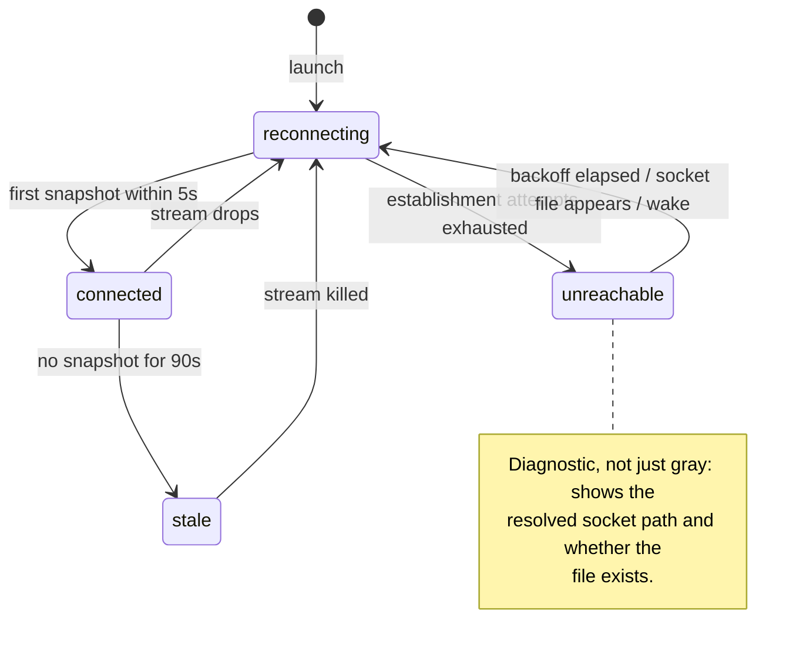

# Runny app architecture

The current shape of the macOS app. Decisions and their alternatives live in
`../architecture-decisions/` (the app's founding decisions are
[ADR-0016](../architecture-decisions/0016-runny-app.md)); this doc tracks the
code at `apps/Runny`.

## The two surfaces

Runny is a sibling client of `runny.v1` over the daemon's unix socket — no
privileged path, symmetric with `runnyctl` by construction (ADR-0006). It
presents two surfaces over one shared connection:

- **Menu bar** — a `MenuBarExtra` (`.window` style) popover: visual
  `runnyctl status`. Connection-state dot, daemon version/uptime (or the
  unreachable diagnostic), one row per slot mirroring runnyctl's status
  semantics.
- **Main window** — `NavigationSplitView`: a sidebar of runners plus a
  daemon card, and a per-slot detail pane with Info, a completed-cycles
  Timeline (from `Why`), and Logs tabs, plus a Doctor pane.

The app is `LSUIElement` and lives in the menu bar; it flips activation
policy to `.regular` while the main window is open and back to `.accessory`
when it closes (ADR-0007, as amended). The proto file is the authority on
the control surface the app consumes; the `SlotState` display mapping
(`apps/Runny/Sources/Client`) is the authority on cycle-order rendering —
neither is enumerated here.

## Connection supervision

`DaemonStore` owns one supervised `WatchStatus` stream and a four-state
connection FSM: a dropped or stalled stream is torn down and re-established,
never nursed — reconnect-on-failure supervision, not the guest-lifecycle
[crash-only](crash-only.md) property (a connection has no VM to destroy and can
sit unreachable). This is the living diagram and tracks the code.

- **connected** — snapshots flowing.
- **reconnecting** — the stream dropped. Every daemon restart cuts streams;
  this is routine, and the UI stays amber through the first backoff round
  rather than flapping to gray on every restart.
- **unreachable** — establishment keeps failing. Rendered as a diagnostic:
  the resolved socket path and whether the file exists ("no socket at
  `~/.runny/runnyd.sock` — is runnyd running, or using a different home?").
- **stale** — the stream is open but silent past the staleness bound. The
  app kills the stream, surfaces "last update Xs ago", and re-enters
  reconnect. An open-but-silent stream is the wedged-but-alive daemon made
  visible — exactly the failure a connection-level check cannot see.

### The bounds

No step of supervision is unbounded:

- **Establishment is end-to-end bounded: dial *plus first snapshot* within
  5s**, or tear down and retry. A UDS `connect()` succeeds into the kernel
  backlog even when nothing is accepting, so a successful connect proves
  nothing; only a received snapshot does.
- **Staleness: 90s without a snapshot.** The server guarantees a 30s
  keepalive tick on `WatchStatus`, so 90s is three missed ticks — slow is
  distinguished from dead by construction, not by guessing.
- **Reconnect backoff: 1s doubling to a 30s cap, with jitter.** Backoff
  resets early on `NSWorkspace.didWakeNotification` and on socket-file
  appearance (a dispatch-source watch on the socket directory), so the app
  is not blind for a backoff interval after sleep or a daemon start.
- **Unary deadlines** on every RPC: 5s for commands, 10s for `Why`/`Doctor`.

## Command confirmation

An RPC success for Pause/Resume/Recycle means **requested**, not done. The
app shows a pending indicator and confirms the command from subsequent
`WatchStatus` snapshots; if confirmation doesn't arrive within 10s, it says
so. Errors switch on the gRPC status code, with the server's message text
rendered verbatim as the fallback. A definitive rejection — `NotFound`,
`FailedPrecondition` (e.g. a resume refused because the daemon is draining,
whose message is shown verbatim), or `InvalidArgument` — proves the command
never applied, so it clears the pending and surfaces the error at once.
Ambiguous errors keep the pending: the daemon may have applied the command
after the error, so the 10s watchdog is the honest adjudicator rather than a
premature failure banner. `Unavailable` is treated as ambiguous, not
definitive: grpc-swift uses it for both the daemon's full-command-buffer
rejection (which did not apply) and a dead transport (which may have applied
before the connection died), indistinguishable at the client, so it fails safe
toward the watchdog. A deadline or transport drop is ambiguous for the same
reason.

The error banner is a single scalar shared across slots, so it carries the id
of the command that raised it. An ambiguous error sets the banner while keeping
the pending; if a later snapshot then confirms that exact command, the
confirmation retracts its own banner — matched by id, so it never wipes a
genuine failure banner belonging to a different slot's command.

Confirmation keys on the **specific command**, not a matching state. A pause
or resume carries a random command id on the request; the daemon records it in
the slot's `recent_applied_command_ids` **only when the command actually
applies**, and the app confirms on its id being **present in that history** —
membership alone, with no paused-direction check. Because the id is recorded
only on apply, membership already proves the command ran; a direction belt would
be worse than redundant, since a fast superseding command (a resume right after
our pause applied) flips `paused` before the next snapshot and would make a
`&& paused` test reject a pause that did run — timing it out into a false
not-confirmed banner. Membership also stops a periodic snapshot that merely
carries `paused=true` from confirming — and so disarming the watchdog for — a
pause the daemon hasn't run yet. A history rather than a single last-applied id
so concurrent clients (the app plus a `runnyctl` invocation, or a fast second
command) don't clobber each other's acknowledgement: each finds its own id
regardless of the others. Recycle has no recorded id and confirms on a cycle
change, the observable it has always used.

The history is bounded and best-effort, not a durable per-client receipt: an id
need only survive from the snapshot that carries it until the app's next poll,
so the cap is generous but finite, and a daemon restart drops it entirely (the
random id can't collide, so the command just waits out its 10s watchdog). The
app keys confirmation off the live `WatchStatus` stream, never off a stored
receipt, so this honesty hole is closed by construction — a missed ack always
fails safe toward the watchdog, never toward a false confirm.

Pause/resume confirmation is gated on the daemon's `protocol_version`. A
daemon that predates the ack contract advertises 0 and never records an id, so
the app reports the command **sent but unconfirmable** (with an upgrade hint)
rather than risk a false confirm or a guaranteed false timeout. While a
command is pending for a slot, a second one — of any kind, including a recycle
over a pending pause/resume or vice versa — is rejected: pending is keyed by
slot, so a second would install a fresh entry under the same key and lose the
first's watchdog. The guard sweeps confirmed and expired pendings to ground
truth before reading them, so a retry in the brief window after a command's 10s
bound elapses but before its entry is reaped can't overwrite a still-live
pending and lose its watchdog.

## Version skew

The app and the daemon it watches can be at different versions — a host where a
Homebrew-managed `runnyd` runs at one release while the app is at another, or the
upgrade window where a new app is already talking to a not-yet-restarted old
daemon. The app renders that divergence as a first-class **warning, never a
refusal**: no control is disabled, no connection is dropped, no command is
blocked on skew.

The detector compares two independent axes, neither implied by the other. The
**version** axis asks "is this the same release line?" — but the two sides
express their version differently: the daemon publishes its full build label
(`0.6.0-beta.<sha>`) while the app's `CFBundleShortVersionString` is already
regex-stripped by the build to its `x.y.z` core. A raw string compare would
false-alarm on every beta and CI build — the same commit, reported two ways — so
the app normalizes the daemon string to its `x.y.z` core before comparing. The
skew warning **names the normalized cores**, not the daemon's full sha-bearing
string — the full daemon version is shown in the `runnyd <version>` line above
either surface — so a same-core daemon rebuild that only rotates its build sha
doesn't re-pop a dismissed warning. The **protocol**
axis asks "can the app rely on the features it was built for?" — it compares the
daemon's monotone `protocol_version` against the version the app's wire stubs
expect. After normalization this is the *only* detector for a same-`x.y.z`
new-app/old-daemon pair, so it is load-bearing, not a backstop. It fires only
when the daemon is *behind* (`<`); a newer daemon serving an older-expecting app
is the safe monotone direction and stays quiet.

The verdict carries a machine-readable `kind` (`versionMismatch` or
`protocolBehind`) rather than only prose, so a consumer acts on the axis, never
by re-parsing the text — the same discipline the wire contract keeps for
`draining`/`exit_held`. It stays quiet for the cases that would otherwise nag
falsely: a daemon whose version isn't known yet (fresh connect, or one predating
the field), and an unstamped dev build (`0.0.0`).

Both surfaces read a single connection-gated `visibleSkew`, so neither view
re-implements the connection check: on a drop the supervisor flips the connection
state without re-running `apply()`, and a stored verdict that outlived the live
stream would assert skew about a daemon that may have recycled. The popover shows
it as a dismissible banner (reading `shownSkew`, `visibleSkew` minus what the
operator dismissed); the main-window daemon card shows it as an always-on row,
since the card is the authoritative status surface and keeps telling the truth
after the popover's nag is silenced. Dismissal is keyed on the whole verdict
value, so a worsening or different-axis skew on the same version string
re-surfaces as new news rather than staying hidden.

## Reload

A Reload control in the popover footer and on the main-window daemon card
validates the on-disk config and drains the fleet toward a respawn; because that
restarts the whole daemon, it is gated behind a confirmation dialog (hosted on
the main window — the popover panel has no reliable presenter, so the popover's
button routes through the window). The drain itself shows through the existing
live stream; the app adds only the **verdict**, baselined on the accepting
process's `boot_id` from the reload response and resolved when a snapshot reports
a different one. Two backstops cover the two failure shapes: a silence deadline
for a daemon that died and never returned, and a `drain_seq` progress stall for
one that still heartbeats but stopped draining — suppressed while a slot is
legitimately long-running or the gate is held. A manual Reconnect cancels an
in-flight reload RPC so a late accept can't arm a verdict against a supervisor
the app has torn down; once a reload is *draining*, Reconnect is disabled
outright, so it can't discard a verdict that's already live. The fingerprint,
the bounding, and the verdict taxonomy are
shared with `runnyctl` and documented once in
[reload-convergence.md](reload-convergence.md).

## Timeline: current and completed cycles

The Timeline tab shows the current in-flight cycle and completed past cycles
from the `Why` RPC.

**Current cycle** — the daemon streams per-state history as part of each
`WatchStatus` snapshot via `SlotStatus.active_cycle_states`. Each entry is a
`StateRecord` with `entered`, `left`, and `outcome`, appended at state
transition: when state N starts, the snapshot includes all states 0..N-1 as
completed records. The current state is `state` + `state_entered` — rendered
with a live ticking clock. The app builds a `[SlotState → TimeInterval]`
lookup from the completed records and passes each duration to the
corresponding pipeline row.

Older daemons that predate this field send `active_cycle_states` as empty;
the app degrades gracefully (pipeline rows show position/glyph only, no
durations for completed states).

**Completed cycles** — fetched from `Why` on demand, rendered from the
`cycle.json` artifact. This path is unchanged.

## Log streams are honestly lossy

Each visible log view owns one `StreamLogs` (bounded replay, then follow),
torn down when the view disappears. Appends land in a bounded in-memory
ring. On reconnect the view inserts a visible discontinuity row ("—
reconnected; lines may be missing or duplicated —"): the stream is
best-effort by contract, log lines carry no sequence key, and pretending to
a gapless tail would be a silent lie. No deduplication is attempted.

## Home and socket path resolution

The home is deployment-resolved, not fixed: `/Library/Application Support/runny`
when that directory exists (a headless system daemon's home), else the per-user
`~/.runny` — mirroring the daemon's `home.ResolveClient`. Selection is by
existence, not a liveness probe. There is no override: no environment variable (a
Finder-launched app inherits launchd's environment, not the shell's, so an
exported variable would never reach it) and no Settings field. The app and daemon
resolve the same home, so they can't disagree about where the socket lives.

The socket is `<home>/runnyd.sock`, and retained-artifact reads (`cycles/`) come
from the same resolved home — one axis, so the app can't dial one home while
reading artifacts from another. On a host carrying a system install the app
targets the system daemon even when it is down (reporting "down" rather than
silently falling back to a per-user socket). The app reads nothing else from the
runny home — files under it belong to the daemon (ADR-0006 symmetry: the app
knows only the contract).

## Command-line tool vending

The `.app` carries the same `runnyd` and `runnyctl` the Homebrew tarball ships,
at `Contents/MacOS/{runnyd,runnyctl}` under their exact bare names. They are
placed and signed **inside-out** by `codesign_app`: each nested binary is signed
first with its own entitlements — the daemon keeps
`com.apple.security.virtualization`, the CLI gets none, both asserted at build
time — then the single outer `codesign` seals the bundle over them. This is not
deprecated `--deep` *signing*; the bundle's notarization then registers a ticket
for each nested Mach-O so Gatekeeper accepts them. The bundled `runnyd` is what
the app registers as a LaunchAgent (see "Daemon lifecycle" below); its stable
in-bundle path is the `BundleProgram` the agent's plist names.

Settings exposes an **Install command-line tool** action that vends the bundled
`runnyctl` as `/usr/local/bin/runnyctl` — the OrbStack/Docker pattern, which
version-locks the CLI to the app for free. The decision logic is two pure
functions in `apps/Runny/Sources/Install/CLIInstallPlan.swift`: a `plan` that
classifies the filesystem state into a verdict, and a `verify` that reads the
result back from disk. Those verdict and result cases are the authority and are
not enumerated here; the invariants the surface guarantees are:

- **Never clobber a foreign file, and name the managing channel.** A regular file,
  or a symlink that doesn't point into a `Runny.app`, is something another channel
  owns; the action refuses it and surfaces the *channel* (Homebrew when the target
  resolves into a Cellar, a hand-rolled link, or a dropped file) with its remediation
  — `brew unlink runny`, say — mirroring the daemon observer banner, not just the raw
  path. (Docker Desktop clobbers a brew-managed CLI; Runny defers.)
- **Reconcile an orphaned link on launch — surface, don't auto-rewrite.** A
  drag-to-trash leaves `/usr/local/bin/runnyctl` dangling (macOS has no uninstall
  hook); a later launch detects the Runny-owned link into a now-missing bundle and
  surfaces a distinct *orphaned* state offering Remove (or Install to re-point), where
  it used to read silently as *not installed*. It never rewrites the link on launch
  unprompted (that would re-raise the admin prompt every restart) and never clobbers a
  foreign owner — the two failure modes Docker Desktop's every-launch re-link has.
- **Fail closed from a translocated bundle.** A link into a translocated
  `…/AppTranslocation/…` copy evaporates on next launch, so the action refuses and
  asks the operator to move Runny to Applications first. (The Security SPI that
  answers translocation authoritatively isn't in the Swift import surface, so the
  detector matches the App Translocation mount path, which Gatekeeper always uses.)
- **One privileged line, guarded at write time.** An unprivileged
  `createSymbolicLink` is tried first; only when `/usr/local/bin` needs admin does
  it escalate, through one `with administrator privileges` shell line whose body
  re-checks the foreign guard at the moment of mutation (test-and-create, never
  `ln -f`), closing the TOCTOU window a `brew install` landing between plan and
  write would open. The path is shell-quoted through the AppleScript layer.
- **Confirmed from disk, never the exit code.** The model flips to *installed*
  only on a read-back that resolves to this bundle, with a distinct *installed-but-
  not-on-PATH* state and loud `conflict`/`translocated`/`failed`/`cancelled`
  states; the admin prompt is bounded by a visible cancel, so it is never a silent
  spinner. The app is accessory, so it activates to the foreground before raising
  the prompt and reverts after.

A menu-bar row nudges toward the action only while the CLI is absent (never on a
dev build that carries no bundled `runnyctl`); the primary surface is Settings.
The vended `runnyctl` can lag a Homebrew-managed `runnyd` on a shared host, so it
carries the same version-skew warning the app does, on its own CLI axis — warn,
never refuse, printed to stderr before command output.

## Daemon lifecycle (app-managed LaunchAgent)

The app installs `runnyd` as a **per-user LaunchAgent via `SMAppService`** —
the desktop channel (ADR-0018). The headless channel is the installed system
LaunchDaemon (`runnyctl install-daemon`), which runs under `_runny` and is
brokered through the app or run directly by the operator. The per-user plist
(`Contents/Library/LaunchAgents/com.coderinserepeat.runnyd.plist`) is injected
into the bundle *before* signing so it is covered by the signature and the
notarization staple, and names the daemon by a bundle-relative
`BundleProgram = Contents/MacOS/runnyd` with
`AssociatedBundleIdentifiers = [com.coderinserepeat.runny]`. The version lock is
free: an in-place app upgrade replaces the bundle, so the job's program *is* the
new binary, and a drain-gated respawn moves the running process onto it. This
is not the system LaunchDaemon plist (an absolute `UserName = _runny` job that
`internal/sysdaemon` generates) — two shapes for two channels, deliberately not
unified.

The app-brokered system daemon's *update* path re-stages the binaries in place with
an atomic tmp-write → `rename(2)` (`SystemDaemonInstaller.restageScript`), never a
`cp`-over: this OS has no `ETXTBSY` guard, so copying over a running binary truncates
the live inode and corrupts the running process. The running daemon keeps the old
inode until the drain-gated reload exits it, and launchd cold-starts onto the
renamed-in binary. The re-stage is update-only — it never re-runs the installer.

`Sources/Lifecycle/` mirrors `DaemonStore`'s split: pure `nonisolated static`
verdicts (`LaunchAgentStatus`) plus a thin side-effect wrapper (`AgentController`)
whose `SMAppService`/`launchctl` calls sit behind a `ServiceRegistrar` protocol
seam, so every decision is unit-tested without launchd. The invariants:

- **`SMAppService` success means *requested*, not *done*.** `installState` is a
  closed, loud set derived from `service.status` — never a call's return:
  `notInstalled`/`installed`/`requiresApproval`/`notFound`, plus
  `registrationFailed(reason:)` for a register/unregister throw. `requiresApproval`
  (Login Items pending) is a first-class CTA, never a silent `notInstalled`. "The
  daemon is actually up" is a separate, later `.connected` snapshot.
- **One spawn chokepoint, gated on ownership.** Every spawn-triggering action
  (install, repair, start-at-login enable, Start) funnels through a single
  `attemptSpawn` that consults the `spawnGate` — the daemon-ownership verdict
  ([ADR-0019](../architecture-decisions/0019-daemon-ownership-detection.md)): it
  allows `unmanaged` and `selfManaged`, and denies `systemManaged`,
  `awaitingApproval`, and `indeterminate`, aborting loud. No view action calls
  `SMAppService`/`launchctl` directly.
- **Ownership is five verdicts over three facts.** Beside `installState` (the
  app's own registration) the controller publishes a `DaemonOwnership` verdict — one
  of `unmanaged`/`selfManaged`/`awaitingApproval`/`systemManaged`/`indeterminate` — a
  pure `classify` over three gathered inputs, in load-bearing order:
  1. **`homeIsCanonical`** — a non-canonical home defers FIRST (a defence-in-depth
     guard; the home override is gone, but a re-introduced one must never cause a
     cross-home stomp).
  2. **`systemProbe`** — a bounded `launchctl print system/<label>` probe on the
     canonical label (`com.coderinserepeat.runnyd`). A registered system daemon wins
     next (`systemManaged`) — it owns the shared socket the app dials, and a
     per-user agent installed over a live system daemon would run orphaned while
     clients keep resolving the system home. A wedged or timed-out probe then fails
     CLOSED (`indeterminate`) — a system daemon MIGHT be here, so never install over
     what can't be ruled out.
  3. **`selfState`** — the app's own `SMAppService` self-status. With no system
     daemon confirmed absent, the verdict is the per-user agent's life stage:
     `.installed` → `selfManaged`, `.requiresApproval` → `awaitingApproval`,
     `.registrationFailed` → `indeterminate`, `.notInstalled`/`.notFound` →
     `unmanaged`. The shared canonical label is disambiguated by self-status, never a
     label match — a system-domain `launchctl bootstrap` never flips the app's
     SMAppService status to `.enabled` (ADR-0019).

  The verdict refreshes on app-foreground and freshly before each spawn (the
  pre-act recheck catches a system daemon that appeared while the window stayed
  open). On a `systemManaged` or `indeterminate` verdict the Daemon row **replaces
  the install toggle with an observer banner**: the `systemManaged` banner names
  the system LaunchDaemon and points at Settings → System Service to remove it;
  the `indeterminate` banner points at `launchctl print system/<label>`. The banner
  shows "Checking…" until the first gather runs, so a pristine launch never flashes
  the indeterminate diagnostic. A hand-run dev daemon reads `unmanaged` — the
  single-instance `flock` makes installing over it converge harmlessly, and it is
  deliberately not detected. The `competing-registration` doctor check and the
  `runnyctl install-daemon` guard catch the edge case where a leftover per-user
  agent is co-registered with a system daemon.
- **Install refuses outside `/Applications`, recoverably.** A translocated bundle
  is refused with "re-launch from Applications" — recoverable, so a first-launch
  quarantine of a correctly-installed app is never permanently locked out. Install
  is behind an explicit click with a label-naming confirmation; the ownership gate
  above is the structural guard that a system daemon is never displaced.
- **Start affordance** (menu bar + main window) shows only when the agent is
  installed and the daemon is unreachable; `requiresApproval` routes to the Login
  Items CTA, never a dead Start. It `kickstart`s (no `-k`) and confirms recovery
  from a later `.connected` snapshot within a healthy-cold-start bound, surfacing
  "Start issued but the daemon hasn't come up" on expiry — never a silent spinner.
- **Proactive Local Network grant card**, driven by the daemon-published
  `local_network_grant` signal, not the button-gated doctor check (which is
  `ok` until a guest boots). It fires *before* the first guest dial fails: UNKNOWN
  (no vmnet yet — prompt may be pending) and DENIED both surface a System-Settings
  deep link; SELF_DAEMONIZED surfaces a DISTINCT card with the launch-context
  remediation (start via launchd or run foreground) and NO deep link, since the
  TCC grant cannot repair a daemon launchd didn't start; REACHABLE and a daemon
  predating the field show nothing.
- **Post-upgrade update**, offered when the app-installed agent is a newer build
  than the running daemon, is the existing drain-gated reload (jobs finish first,
  then launchd cold-starts the new binary) — it adds nothing to the drain
  mechanics. A non-converged result is named loud ("update didn't take — still
  vX"), never folded into the generic reload note. A system daemon is offered only
  the generic skew banner, not a futile fleet-draining update.
- **The config-compat gate** (`ConfigCompatGate`, `Sources/Lifecycle`) execs the
  bundled `runnyd -test-config <in-place config>` (via the bounded-process shell)
  and parses its JSON verdict (`ok`/`warn`/`error`, with warnings) — the substrate
  for gating an update on the *new* binary accepting the *current* config, so a
  schema-incompatible upgrade is blocked rather than drained into a crash-loop.
  Parsing is the pure, unit-tested surface; an unparseable verdict is `unavailable`
  (blocking), never a fabricated OK. **The gate verdict IS the prompt** (popups, not
  inline rows — a row rendered behind the modal reload prompt was easy to miss), with
  one authoritative re-check at the commit — the model that collapses the
  approval-lifecycle edges (TOCTOU, re-confirm loops, stale/cancelled approvals) into
  impossibility rather than handling each:
  - **Click drives the popup.** `DaemonStore.gatedDaemonUpdate` probes once and the
    verdict picks the prompt: **OK** reloads immediately with no prompt (clicking
    Update/Reload was the consent); **Warn** presents a confirm-or-cancel alert
    listing the warnings (Cancel is the safe default, "Reload Anyway" the destructive
    deliberate action); **Error**/`unavailable` presents an acknowledge-only alert and
    reloads nothing. The OK/Warn/Error decision is the pure `ConfigCompatGate.updateGate`.
    The warnings/block are *display only* — never persisted as an "approved set" or
    compared at commit, so there is no stale approval to leak across a cancel or a
    later reload; both clear on dismiss and on convergence/reconnect.
  - **Commit is the backstop.** `performReload`, immediately before the irreversible
    drain+respawn, re-probes the bundled (new) runnyd against the current on-disk
    config: a hard incompatibility (or an `unavailable` probe) **blocks** with no
    reload, surfaced through the always-presented command-error alert (the same
    "reload not sent" channel as the unreachable-daemon case). The daemon's own reload
    preflight runs the *old* binary — blind to what the new one rejects — so this is
    the only check that sees it. A *warning* found only here is not re-surfaced: it's
    non-fatal (the daemon comes up), and the only way the verdict could differ from
    the click is the operator editing `config.yaml` in the seconds between click and
    reload — an accepted, commented residual, not a state machine.
  **Both entry points share one action** (`startGatedReload`): the Update Daemon
  affordance and the plain Reload Config buttons. The per-user agent's `BundleProgram`
  points at this app bundle, so when the app is ahead *any* drain-gated reload respawns
  the newer binary — so a reload that `reloadMightUpgrade` (which **fails closed** while
  the agent facts are unsettled, and only when the app is actually ahead) routes through
  the same gate; a reload that can't upgrade falls through to the generic reload confirm.
  Default-on auto-apply on OK is the next slice.
- **Uninstall** is `unregister()` then a best-effort `launchctl bootout` ("No such
  process" = success); a mid-job uninstall first raises a destructive confirmation
  naming the abandoned slot. **Reconcile-on-launch** compares the registered
  agent's program path (bounded `launchctl` introspection) against the canonical
  `/Applications/Runny.app` — never the running bundle's path — and surfaces a
  foreign/stale-path agent, or "couldn't determine" on a timeout. A stale-path
  self-managed agent is repairable in place from a canonical bundle: **Repair**
  does a verified `unregister`→`register` replace (a bare re-register is not a
  reliable re-point) through the spawn chokepoint, then re-reconciles to self-verify
  (the reconcile coalesces a concurrent trigger so the verification is never
  dropped; a re-point that doesn't take keeps showing foreign, never a false
  all-clear). It is reached only for the app's own agent — the ownership gate denies
  a system/indeterminate owner and the observer banner replaces the section hosting
  the button — so a system daemon is never unregistered. A failed re-register after the
  unregister took leaves the agent honestly gone (the toggle offers reinstall); a
  denied gate never unregisters, so a foreign agent stays intact.

## Build shape

`swift_library` → `macos_application` (rules_apple) → plist injection → the sign /
notarize / dmg chain in `apps/Runny/BUILD` — no .xcodeproj, ever (ADR-0007).
`codesign_app` places and signs the bundled `runnyd`/`runnyctl` inside-out
(above), and an `inject_launch_agent` genrule lands the LaunchAgent plist in the
bundle before signing; a Darwin-gated `bundle_contents_test` asserts the binaries'
names, signatures, per-binary entitlements, that each execs, and that the plist is
present and sealed into the signature. All Swift targets are darwin-only
(`target_compatible_with`), so non-macOS hosts prune them from `//...` before
toolchain resolution. Building the app requires full Xcode as SDK vendor; it is
never opened. Distribution is a notarized, stapled .dmg (ADR-0016).
