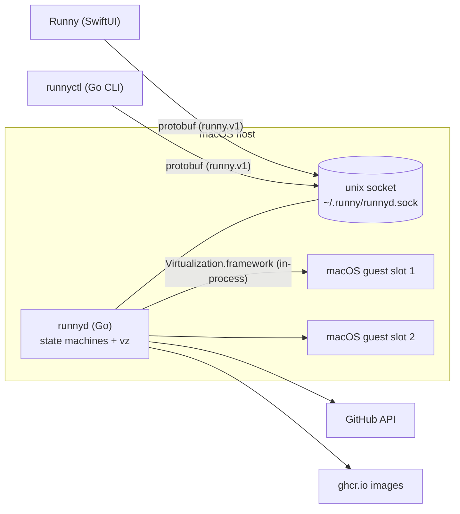

# runnyd architecture

The current shape of the daemon. Decisions and their alternatives live in
`../architecture-decisions/`; this doc tracks the code.

## System shape

`runnyd` runs one destroy-and-recycle state machine per runner slot, boots tart-format
guests in-process via Virtualization.framework (`internal/vm`), provisions
them over deadline-bounded SSH (`internal/sshx` → `internal/guest`),
registers them with GitHub via JIT config (`internal/github`), and serves the
`runny.v1` control surface over a unix socket (`internal/socket`) to
`runnyctl` and the `Runny` app as equal clients. The layout decision is
[ADR-0006](../architecture-decisions/0006-monorepo-layout-protobuf-contract.md);
this diagram is the living copy and tracks the code.



## The cycle

The FSM design (per-state deadlines, the TEARDOWN sink, backoff
policy) is decided in
[ADR-0004](../architecture-decisions/0004-destroy-and-recycle-state-machine.md), and the
property it implements — no silent failure, via destroy-and-recycle — is defined
in [no-silent-failure.md](no-silent-failure.md); the per-cycle SSH hardening state is
[ADR-0013](../architecture-decisions/0013-ephemeral-ssh-keys-in-band-rotation.md).
The code (`internal/statemachine`) is the authority on states and deadline
defaults; the diagram below is the living transition map and tracks the code.

```mermaid
stateDiagram-v2
    [*] --> BACKOFF: startup sweep done
    BACKOFF --> ENSURE_IMAGE: backoff elapsed
    ENSURE_IMAGE --> CLONE: image cached (digest)
    CLONE --> BOOT: clonefile × 3 + runner tarball
    BOOT --> AWAIT_IP: vz state Running
    AWAIT_IP --> AWAIT_SSH: dhcpd lease for our MAC
    AWAIT_SSH --> SECURE_SSH: authed session (ssh_hardening rotate/scramble)
    AWAIT_SSH --> MINT_JIT: authed session (ssh_hardening off)
    SECURE_SSH --> MINT_JIT: per-cycle key live, host key pinned
    MINT_JIT --> PROVISION: encoded_jit_config
    PROVISION --> LISTENING: "Listening for Jobs"
    LISTENING --> JOB: "Running job:"
    LISTENING --> TEARDOWN: zombie / liveness lost / max-idle / recycle
    LISTENING --> DEBUG: debug key injected (runner killed + verified)
    JOB --> TEARDOWN: job completed (success path)
    JOB --> DEBUG: armed hold (job end; listener killed + verified)
    DEBUG --> TEARDOWN: recycle / hold expiry / daemon shutdown
    TEARDOWN --> BACKOFF: cycle.json written

    note right of TEARDOWN
        Universal sink: every non-terminal state
        transitions here on ANY error or deadline
        expiry. Post-mortem first (failure cycles),
        then stop -> force-stop -> delete -> dereg.
        Cannot fail; escalating force is the floor.
    end note
```



Per-state work is delegated through interfaces (`ImageEnsurer`, `Cloner`,
`vm.Manager`, `Dialer`, `GitHub`), which is what lets the FSM's guarantees be
tested with fakes on any OS while the darwin-only implementations stay thin.

The pool's slots enter ENSURE_IMAGE together on a cold start and share one image
pull through a per-destination actor: one pull runs, the rest subscribe to its
outcome. A deterministic disk-headroom refusal holds and polls for free space —
all subscribers wait together rather than each re-running the doomed pull — for a
bounded window, then hands the failure back to each FSM's backoff; a transient
failure broadcasts immediately so each slot retries on its own. The decision and
its rejected alternatives are
[ADR-0021](../architecture-decisions/0021-shared-image-pull.md).

The actions-runner tarball follows the same download-once shape but with
per-cycle ownership. ENSURE_IMAGE downloads the service-blessed build into a
shared store (`cache/actions-runner/`) — fail-fast on a bad download before a VM
boots, and dedup across slots — but CLONE then copy-on-write-clones this cycle's
resolved tarball (`clonefile(2)`, near-instant) out of the store into the slot's
own mount (`vms/<slot>/runner/`), and BOOT mounts *that*, not the store.

Per-cycle ownership is what keeps staging safe. The cycle owns its tarball from
CLONE to TEARDOWN, so no concurrent slot can delete a version another is still
staging (a slot resolves its version at ENSURE_IMAGE but doesn't stage it until
PROVISION, a whole boot later), the cold-start store prune never touches a live
cycle, and the mount holds exactly one tarball — staging it by exact name, never
a glob, keeps the on-disk record honest and the cache-miss diagnostic precise.
Mounting one shared store into every guest would carry all three of those races;
cloning removes them by construction, which is why the mount is per-slot rather
than the store. The store is then pure download cache, pruned to the newest few
versions per flavor at cold start — where no cycle is live, so the prune is
race-free without a careful never-touch rule.

## Package map

| Package | Owns |
| --- | --- |
| `internal/bounded` | `bounded.Context` — the no-unbounded-operations invariant as a type (ADR-0011); wall-clock and progress-stall bounds |
| `internal/home` | the `~/.runny` layout and the config schema (parse/default/validate once, at the boundary); a non-fatal warnings channel (`Config.Warnings`) runs local soft-validations feeding the config-compat gate (ADR-0022) |
| `internal/cycle` | cycle.json records: write/read/prune, retention |
| `internal/clonefile` | the APFS clonefile(2) wrapper: single-file copy-on-write clone (darwin); home of the darwin/non-darwin split both clone callers share |
| `internal/tart` | tart bundle format: config.json parse, validation, bundle clone (per file via `internal/clonefile`) |
| `internal/oci` | tart-format image pull: registry auth, manifest, Apple-LZ4 disk assembly; declared sizes enforced on every blob and decode |
| `internal/sshx` | the only constructor of SSH clients (deadline recipe) |
| `internal/guest` | what to *do* over SSH: stage runner from the per-slot virtiofs share, run.sh, diag pull |
| `internal/github` | App JWT → installation token → JIT config; list/delete for reconcile |
| `internal/vm` | Virtualization.framework boot (darwin), dhcpd-lease IP resolution |
| `internal/statemachine` | the FSM; depends only on the seams above |
| `internal/logring` | slog → file sink + in-memory rings for StreamLogs (daemon log, and a second ring of guest runner output — the default `runnyctl logs` stream) |
| `internal/socket` | the gRPC server over the unix socket |

Dependency direction: `cmd/runnyd` wires everything; `internal/statemachine`
sees only interfaces; leaf packages see nothing of each other (exception:
`guest` and `vm` import `sshx`/`tart` respectively — format and transport are
their job).

## Daemon lifecycle

1. **Load + sweep clones**: config parse (strict), the instance lock, then
   delete `vms/*` — *before* validation, because teardown retains a wedged
   guest's clone (ADR-0012) and its divergence must not fail `disk-headroom`
   ahead of the sweep that would free it (ADR-0014). The sweep runs only on
   the real-startup path under the lock; `-doctor` stays read-only.
2. **Validate**: the doctor suite (the check inventory lives in
   `cmd/runnyd`'s `makeDoctor`; `runnyd -doctor` prints it, and it includes
   a `config-drift` check against the running config, and a Darwin-only
   `competing-registration` check that warns — non-blocking — when a leftover
   per-user LaunchAgent is co-registered alongside the system daemon). Any
   failure refuses startup loudly. The `runnyd starting` line logs the config file's
   SHA-256, chaining the audit trail across reload restarts.
3. **Sweep registrations** (cold start owns the world): deregister offline
   runners carrying our instance prefix.
4. **Run**: one goroutine per slot + the socket server. SIGINT/SIGTERM cancels
   the root context; in-flight cycles fail into TEARDOWN (which detaches from
   the root context so cleanup always completes), then the daemon exits.
   SIGHUP triggers a validated config reload instead of killing the process
   (ADR-0014). Runner tarballs are ensured inside each cycle's ENSURE_IMAGE —
   deliberately not at startup, where an unbounded download once blocked the
   socket. Under the Windows Service Control Manager, an SCM Stop/Shutdown
   command cancels this same root context in place of SIGTERM
   (`cmd/runnyd/svc_windows.go`) — one shutdown path, not two.

## Draining: the two restart causes

A wedged guest (ADR-0012) and a config reload (ADR-0014) share one drainer
in `cmd/runnyd`: pause + recycle every slot — running jobs finish first —
re-issued on every status change until each slot is stable (wedged, or
paused in BACKOFF, which cannot start a job). At convergence a local exit
gate re-parses the on-disk config: if it no longer parses the daemon
*holds* (drained, still serving status with the hold annotation,
periodically revalidating) rather than handing launchd a file the respawn
would refuse; otherwise it exits non-zero (`restarting after drain: …`)
and launchd KeepAlive cold-starts it (on Windows, that same non-zero exit
becomes a service-specific exit code for the SCM's configured recovery
action to read the same way). The drain cause is visible as
`GetStatusResponse.draining` (the `DRAINING` banner in runnyctl) and in
each interrupted cycle's recycle reason.

The drainer also bumps a `drain_seq` counter on every real progress event (a
slot transition, an exit-gate hold flip) and publishes it alongside the
process's `boot_id` and loaded `config_sha256`. These are what let a client
confirm the respawn that comes back is the one it asked for, and tell a
slow-but-healthy drain apart from a hung one — the client-facing other half is
[reload-convergence.md](reload-convergence.md).

## The config-compat gate (`-test-config`)

`runnyd -test-config <path>` validates a config with the **new** binary and
prints a machine-readable verdict, so an update can be gated on "will the new
binary accept the in-place config?" — the question the running daemon's reload
preflight structurally cannot answer (it validates against the *old* schema).

It runs **local checks only** — strict parse + `validate()`, the macOS guest
cap, the runner-name length cap, the per-pool image-reference parse
(`oci.ParseRef`, which startup also runs before booting a slot), and the
soft-validation warnings (`Config.Warnings`) — and **no** network checks: upgrade-readiness is a question
about config-schema compatibility, not live GitHub/registry/disk health, and a
transient blip must never refuse a valid upgrade. It is read-only — no lock, no
network, no writes (no `instance-id` generated). The runner-name cap is checked
against the persisted prefix when it can be read (matching exactly what the
daemon validates at startup), else a conservative worst-case prefix that can
over-refuse a borderline config but never under-estimate the real prefix into a
false OK — a renamed host keeps its longer persisted prefix, so a stateless
current-hostname guess could otherwise green-light a config the respawn rejects.

The verdict is JSON on stdout — a stable, cross-language contract the Swift app
and `runnyctl` both parse:

```json
{ "status": "ok" | "warn" | "error", "errors": ["…"], "warnings": [{ "kind": "…", "message": "…" }] }
```

`ok` applies an update; `warn` drops to a manual confirmation showing the
warnings; `error` blocks and names the incompatibility. `errors` and `warnings`
are always arrays (never null). The exit code mirrors the status (0 for
ok/warn, non-zero for error), but the JSON is the contract. This is distinct
from `-doctor`, which runs the full network suite for operational diagnosis.

## On-disk layout

`internal/home` is the authority. Shape: `config.yaml`, `runnyd.sock` (0600),
`logs/runnyd.log`, `images/<ref>/<digest>/` (immutable cache),
`vms/<slot>/` (ephemeral, swept) — including `vms/<slot>/runner/`, the cycle's
own per-slot virtiofs mount holding its single cloned runner tarball —
`cache/actions-runner/` (the runner-tarball download store, cold-start pruned;
never mounted into a guest),
`cycles/<slot>/<started>-<id>/cycle.json` (+ post-mortem artifacts on
failure cycles; success cycles keep only the record). A cycle that saw an
operator debug-key attempt also carries `operator-access.json` — the
write-ahead audit sidecar, written before any byte reaches the guest and
surfaced in `runnyctl why` even after a daemon crash that left no cycle.json
(ADR-0014).

The whole tree must live on a single APFS volume: cloning is `clonefile(2)`,
which fails `EXDEV` across volumes, and both the bundle clone (`images/` →
`vms/`) and the runner-tarball clone (`cache/` → `vms/`) depend on it. Relocating
one subdirectory onto another disk breaks the clone, not just the disk math.

## Commands during a cycle

Operator commands (`recycle`, `pause`, `resume`, `debug`) ride one buffered
channel per slot; exactly one FSM select owns it at any instant. Every state
that can hold a guest services it (ADR-0015):

- **Boot-path states** — the runCycle watcher cancels the cycle on `recycle`;
  `debug` is rejected (no usable guest yet).
- **LISTENING** — `recycle` ends the cycle; `debug` runs the freeze into DEBUG.
- **JOB** — `recycle` (plain) disarms any debug hold and lets the job finish;
  `recycle -force` (`cancel_running_job`) cancels the job into teardown;
  `pause`/`resume` take effect immediately; `debug` installs the key into the
  running job without touching it and arms a post-job hold.
- **DEBUG** — `recycle` releases (always destructive); `debug` extends the hold
  or adds a key.
- **BACKOFF** — a teardown-stranded plain recycle is drained and discarded
  before the timer arms, so it can never cancel the next cycle's boot.

## Operational sharp edges

- **A debug hold counts against the macOS guest cap.** A frozen or armed guest
  occupies its slot's cap share for the whole hold; worst-case slot occupancy
  is `max_job_duration + max_debug_hold` (4h default, since a mid-job arm's hold
  clock starts only at job end). Both knobs are tunable and the occupancy is
  visible in `status` throughout. Release is always destructive — there is no
  path back to LISTENING; recycling (or hold expiry) destroys the guest.
  Extending an installed key is exec-free.
- **Pausing or plain-recycling an armed slot disarms the hold immediately.**
  Two operator intents collided and pause/recycle won; the live `debug_hold_
  armed` status drops at once (no lingering lie), an Error/Warn line is logged,
  and a `disarmed` audit entry is written. The recovery is resume + re-inject
  next cycle. This is what lets the wedge drain never stall behind a hold.
- **macOS Local Network privacy (TCC)**: a self-daemonized / reparented runnyd
  (one launchd did not start) gets silently denied vmnet access — every guest
  dial fails with `connect: no route to host` while the host shell reaches the
  same port. A launchd-started daemon of any uid, and foreground children of
  sshd, are auto-allowed. runnyd reads its launch context at startup (via the
  `XPC_SERVICE_NAME` launchd sets) and makes the orphaned case loud — a red
  `local-network` check, an Error log, and a distinct `SELF_DAEMONIZED` value on
  the status-published `local_network_grant` (so the app/CLI render the
  launch-context fix, not the dead-end TCC-grant ask), all before the first guest
  dial — without refusing to boot, since foreground and launchd starts are fine.
  The deployment
  owns the grant story via a per-user LaunchAgent (SMAppService) or an
  installed system LaunchDaemon (`runnyctl install-daemon`); symptoms and
  the fix live in
  `docs/deploy.md` "Troubleshooting: Local Network permission".
- **Never trust the image's bundled runner**: cirruslabs images preinstall
  `~/actions-runner`, which rots into broker-rejected versions ("deprecated
  and cannot receive messages") that JIT runners cannot self-update out of.
  The provision script always stages from the per-slot mount (a clone of the
  shared store, which is itself sourced from the repo's
  `/actions/runners/downloads` endpoint — the service's own answer to "which
  build works"), by the exact tarball name this cycle resolved, never a glob.
- **Seed the image cache from tart's** when migrating a host: the bundles are
  clonefile-compatible (`cp -c` the four files into
  `images/<ref>/<digest>/`), avoiding an 80GB+ re-pull.
- **Seed the cache over LAN when the registry path is bad**: `tools/seedpull`
  pulls a ref into a runny-layout cache on any box with healthy connectivity
  (`go run ./tools/seedpull <ref> <dir>` — pure Go, runs on Linux); rsync the
  bundle to the host's `images/` and the next ENSURE_IMAGE cache-hits.
  Pause the slot during the copy so a concurrent pull's rename doesn't race.

## Validated against real infrastructure

Every path below has run live on ix (macOS and linux guests, real GitHub
App, real images), not just under test fakes:

- The full cycle, cold boot to job: ENSURE_IMAGE through LISTENING, job
  pickup, success TEARDOWN, ephemeral self-removal, failure-counter reset.
  A dispatched job completes in well under two minutes from a cold slot.
- Failure handling: registry stalls surface as stall-vs-slow progress and
  recycle cleanly; a vanished registration (GitHub deregisters a JIT runner
  whose job acquisition fails) is zombie-detected by the LISTENING reconcile
  within its interval, recycled, and leaves a diag capture in the cycle dir.
  A guest that survives even force-stop wedges its slot: the teardown is
  recorded as an error, the slot parks, the daemon drains the remaining
  slots to a paused idle (running jobs finish first), and then exits for a
  launchd cold start — process exit is the only thing that reclaims an
  in-process VM (ADR-0012).
- Operator surface: recycle deregisters; pause holds; SIGTERM mid-cycle
  leaves zero VMs, zero vm dirs, zero registrations; `runnyctl reload` (or
  SIGHUP) validates the on-disk config and drains to a respawn, with the
  drain cause in the status `draining` field.
- SSH hardening (ADR-0013), both OSes: SECURE_SSH rotates in about a second
  per cycle; mid-cycle password SSH to a hardened guest is refused with the
  password method not even offered (`Permission denied (publickey)`); a pool
  set `ssh_hardening: off` accepts password auth and skips the state, and
  rotate/off pools coexist in one daemon with per-pool behavior intact. A
  transient PROVISION failure after a successful rotation recycles cleanly —
  the next cycle rotates fresh. (`ssh_hardening: scramble` is unit-tested
  only; it hasn't run live on ix yet.)
