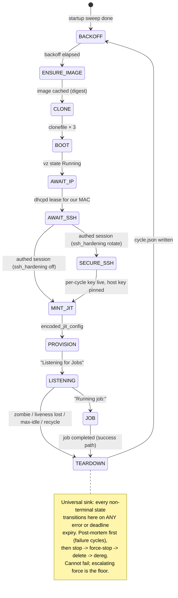

# runnyd architecture

The current shape of the daemon. Decisions and their alternatives live in
`../architecture-decisions/`; this doc tracks the code.

## System shape

`runnyd` runs one crash-only state machine per runner slot, boots tart-format
guests in-process via Virtualization.framework (`internal/vm`), provisions
them over deadline-bounded SSH (`internal/sshx` → `internal/guest`),
registers them with GitHub via JIT config (`internal/github`), and serves the
`runny.v1` control surface over a unix socket (`internal/socket`) to
`runnyctl` and `RunnyBar` as equal clients. The layout decision is
[ADR-0006](../architecture-decisions/0006-monorepo-layout-protobuf-contract.md);
this diagram is the living copy and tracks the code.

## The cycle

The crash-only FSM design (per-state deadlines, the TEARDOWN sink, backoff
policy) is decided in
[ADR-0004](../architecture-decisions/0004-crash-only-state-machine.md); the
per-cycle SSH hardening state is
[ADR-0013](../architecture-decisions/0013-ephemeral-ssh-keys-in-band-rotation.md).
The code (`internal/statemachine`) is the authority on states and deadline
defaults; the diagram below is the living transition map and tracks the code.

Per-state work is delegated through interfaces (`ImageEnsurer`, `Cloner`,
`vm.Manager`, `Dialer`, `GitHub`), which is what lets the FSM's guarantees be
tested with fakes on any OS while the darwin-only implementations stay thin.

## Package map

| Package | Owns |
| --- | --- |
| `internal/bounded` | `bounded.Context` — the no-unbounded-operations invariant as a type (ADR-0011); wall-clock and progress-stall bounds |
| `internal/home` | the `~/.runny` layout and the config schema (parse/default/validate once, at the boundary) |
| `internal/cycle` | cycle.json records: write/read/prune, retention |
| `internal/tart` | tart bundle format: config.json parse, validation, clonefile |
| `internal/oci` | tart-format image pull: registry auth, manifest, Apple-LZ4 disk assembly; declared sizes enforced on every blob and decode |
| `internal/sshx` | the only constructor of SSH clients (deadline recipe) |
| `internal/guest` | what to *do* over SSH: stage runner from the virtiofs share, run.sh, diag pull |
| `internal/github` | App JWT → installation token → JIT config; list/delete for reconcile |
| `internal/vm` | Virtualization.framework boot (darwin), dhcpd-lease IP resolution |
| `internal/statemachine` | the FSM; depends only on the seams above |
| `internal/logring` | slog → file sink + in-memory rings for StreamLogs (daemon log, and a second ring of guest runner output — the default `runnyctl logs` stream) |
| `internal/socket` | the gRPC server over the unix socket |

Dependency direction: `cmd/runnyd` wires everything; `internal/statemachine`
sees only interfaces; leaf packages see nothing of each other (exception:
`guest` and `vm` import `sshx`/`tart` respectively — format and transport are
their job).

## Daemon lifecycle

1. **Load + validate**: config parse (strict), then the doctor suite (the
   check inventory lives in `cmd/runnyd`'s `makeDoctor`; `runnyd -doctor`
   prints it). Any failure refuses startup loudly.
2. **Sweep** (cold start owns the world): delete `vms/*`, deregister offline
   runners carrying our instance prefix.
3. **Run**: one goroutine per slot + the socket server. SIGINT/SIGTERM cancels
   the root context; in-flight cycles fail into TEARDOWN (which detaches from
   the root context so cleanup always completes), then the daemon exits.
   Runner tarballs are ensured inside each cycle's ENSURE_IMAGE — deliberately
   not at startup, where an unbounded download once blocked the socket.

## On-disk layout

`internal/home` is the authority. Shape: `config.yaml`, `runnyd.sock` (0600),
`logs/runnyd.log`, `images/<ref>/<digest>/` (immutable cache),
`vms/<slot>/` (ephemeral, swept), `cache/actions-runner/` (virtiofs share),
`cycles/<slot>/<started>-<id>/cycle.json` (+ post-mortem artifacts on
failure cycles; success cycles keep only the record).

## Operational sharp edges

- **macOS Local Network privacy (TCC)**: a background-reparented ad-hoc
  runnyd gets silently denied vmnet access — every guest dial fails with
  `connect: no route to host` while the host shell reaches the same port.
  Foreground children of sshd inherit its exemption. The deployment owns the
  grant story via a per-user LaunchAgent; symptoms and the fix live in
  `docs/deploy.md` "Troubleshooting: Local Network permission".
- **Never trust the image's bundled runner**: cirruslabs images preinstall
  `~/actions-runner`, which rots into broker-rejected versions ("deprecated
  and cannot receive messages") that JIT runners cannot self-update out of.
  The provision script always stages from the cache share, which is itself
  sourced from the repo's `/actions/runners/downloads` endpoint — the
  service's own answer to "which build works".
- **Seed the image cache from tart's** when migrating a host: the bundles are
  clonefile-compatible (`cp -c` the four files into
  `images/<ref>/<digest>/`), avoiding an 80GB+ re-pull.
- **Seed the cache over LAN when the registry path is bad**: `tools/seedpull`
  pulls a ref into a runny-layout cache on any box with healthy connectivity
  (`go run ./tools/seedpull <ref> <dir>` — pure Go, runs on Linux); rsync the
  bundle to the host's `images/` and the next ENSURE_IMAGE cache-hits.
  Pause the slot during the copy so a concurrent pull's rename doesn't race.

## Validated against real infrastructure

Every path below has run live on ix (macOS and linux guests, real GitHub
App, real images), not just under test fakes:

- The full cycle, cold boot to job: ENSURE_IMAGE through LISTENING, job
  pickup, success TEARDOWN, ephemeral self-removal, failure-counter reset.
  A dispatched job completes in well under two minutes from a cold slot.
- Failure handling: registry stalls surface as stall-vs-slow progress and
  recycle cleanly; a vanished registration (GitHub deregisters a JIT runner
  whose job acquisition fails) is zombie-detected by the LISTENING reconcile
  within its interval, recycled, and leaves a diag capture in the cycle dir.
  A guest that survives even force-stop wedges its slot: the teardown is
  recorded as an error, the slot parks, the daemon drains the remaining
  slots to a paused idle (running jobs finish first), and then exits for a
  launchd cold start — process exit is the only thing that reclaims an
  in-process VM (ADR-0012).
- Operator surface: recycle deregisters; pause holds; SIGTERM mid-cycle
  leaves zero VMs, zero vm dirs, zero registrations.
